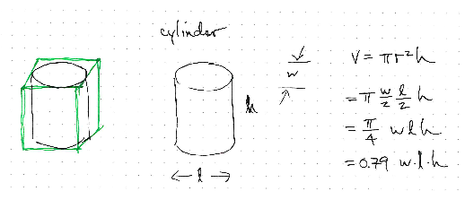
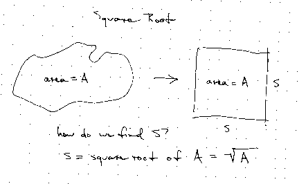
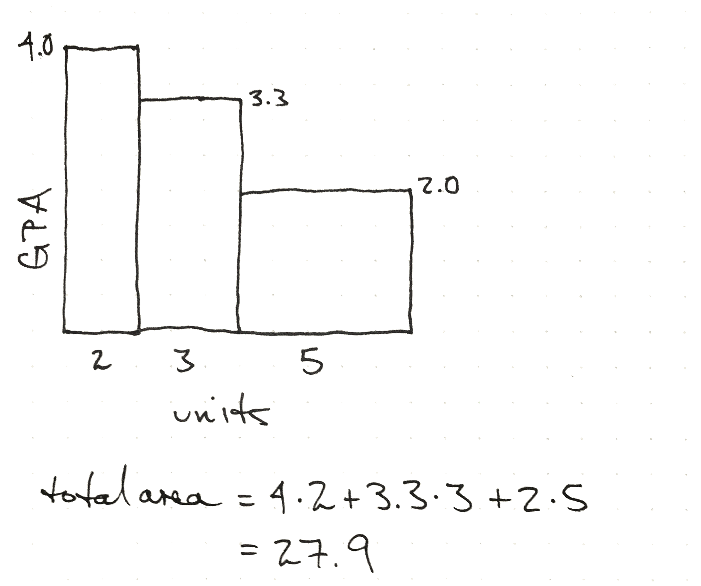

<h1 id="unit-conversion">Unit Conversion</h1>

We often need to convert between units of area and volume. When we do
this, we need to look out for some common mistakes.

<h2 id="dimensions">Dimensions</h2>
<ul>
<li>A length is a dimension</li>
<li>Area has dimensions of length squared</li>
<li>Volume has dimensions of length cubed</li>
</ul>
<h2 id="units">Units</h2>
<ul>
<li>Any two lengths is a valid unit of area
<ul>
<li>meters squared</li>
<li>inch-feet</li>
</ul></li>
<li>Any three lengths is a valid unit of volume
<ul>
<li>meters cubed</li>
<li>inch-feet-meters</li>
</ul></li>
<li>An area times a length is also a valid unit of volume
<ul>
<li>acre-foot</li>
</ul></li>
<li>We have units of area that don’t use lengths
<ul>
<li>acre</li>
</ul></li>
<li>We also have units of volume that don’t use lengths
<ul>
<li>liter</li>
<li>gallon</li>
</ul></li>
</ul>
<h1 id="intuition">Intuition</h1>
<ul>
<li>What is something about the volume of a milliliter?</li>
<li>What is something about a liter?</li>
<li>A cubic foot?</li>
<li>A cubic meter?</li>
</ul>

It is useful to have a visualization of how linear conversions, area
conversions, and volume conversions are related. The <a
href="https://en.wikipedia.org/wiki/Rubik%27s_Cube#/media/File:Rubiks_cube_solved.jpg">Rubik’s
Cube</a> is a good visualization.

If we imagine the three-by-three cube side as a yard, we can imagine
each block as a foot. Then we see that there are

<ul>
<li>3 feet in a yard</li>
<li>9 (3 x 3) square feet in a square yard</li>
<li>27 (3 x 3 x 3) cubic feet in a cubic yard</li>
</ul>
<h2 id="converting-areas">Converting areas</h2>

A common source of error is forgetting to apply a linear conversion
multiple times to get an area or volume conversion.

 1 m^2 = 1 \cdot meter \cdot meter

Here we convert a square meter to square centimeters.

 1 \cdot meter \cdot meter \cdot
\frac{100cm}{meter}  \cdot \frac{100cm}{meter} = 10^4 cm^2

We can also convert from mixed unit areas to other units.

Example: Convert 2 inch-feet to square centimeters

 2\; \cancel{\textrm{inch}}\;
\cancel{\textrm{foot}} \frac{2.54\; cm}{\cancel{inch}} \frac{30.5\;
cm}{\cancel{foot}} = 155\; cm^2 

Alternate approach:

By multiplying equations, we can get the unit conversion equation
between inch-foot and square centimeters.

 1 inch = 2.54 cm   1 foot = 30.48 cm   1\; inch\; foot = 77.4 cm^2 

We then multiply by 2 to get the conversion.

 2 \cdot 1\; inch\; foot = 77.4 cm^2 \cdot
2 

 2 \; inch\; foot = 155 cm^2 

<h2 id="converting-volumes">Converting volumes</h2>

Here we show two methods for converting a cubic meter to cubic
centimeters.

 1 m^3 \cdot \frac{100cm}{m}  \cdot
\frac{100cm}{m}  \cdot \frac{100cm}{m} = 10^6 cm^3  1 m^3 \cdot \left( \frac{100cm}{m} \right)^3 =
1m^3 \cdot \frac{10^6 cm^3}{m^3} = 10^6 cm^3 

<h3 id="alternate-approach">Alternate approach</h3>

Start with the equation

 1 meter = 100 cm 

multiply the equation by itself three times (cube the equation)

 1^3 meter^3  = 100^3 cm^3 

 1 meter^3  = 1,000,000 cm^3 

 1 meter^3  = 1 \cdot 10^6 cm^3

We can then use this to convert a quantity:

 10 \cdot 1 meter^3 = 1 \cdot 10^6 cm^3
\cdot 10 

 10 meter^3 = 10^7 cm^3 

<figure>

<figcaption aria-hidden="true">Area Equation Animation</figcaption>
</figure>
<h2 id="converting-volumes-1">Converting volumes</h2>
<ul>
<li>How many cubic inches in a cubic foot?</li>
</ul>

You can use a unit conversion from

<ul>
<li>inches to feet</li>
<li>from cubic inches to cubic feet</li>
</ul>
<h2 id="converting-volumes-2">Converting volumes</h2>
<ul>
<li>Convert cubic meters to gallons</li>
</ul>

Gallons are not based on a length, so you convert directly.

<h1 id="estimations-using-common-shapes">Estimations using common
shapes</h1>

We rarely measure areas directly. For example, there is no tape
measure that has an area.

<h2 id="rectangle">Rectangle</h2>
<figure>

<figcaption aria-hidden="true">Rectangle</figcaption>
</figure>
<h2 id="circle">Circle</h2>
<figure>

<figcaption aria-hidden="true">Circle</figcaption>
</figure>
<h2 id="ellipse">Ellipse</h2>
<figure>

<figcaption aria-hidden="true">Ellipse</figcaption>
</figure>
<h2 id="any-shape">Any shape</h2>
<figure>

<figcaption aria-hidden="true">General shape</figcaption>
</figure>
<h2 id="areas">Areas</h2>
<ul>
<li>Notice that these all involve the length and the width and a
factor</li>
</ul>
<table>
<thead>
<tr class="header">
<th style="text-align: left;">shape</th>
<th style="text-align: left;">area</th>
</tr>
</thead>
<tbody>
<tr class="odd">
<td style="text-align: left;">rectangle</td>
<td style="text-align: left;">l \cdot
w</td>
</tr>
<tr class="even">
<td style="text-align: left;">circle</td>
<td style="text-align: left;">0.79\ l \cdot
w</td>
</tr>
<tr class="odd">
<td style="text-align: left;">ellipse</td>
<td style="text-align: left;">0.79\ l \cdot
w</td>
</tr>
</tbody>
</table>
<h2 id="area">Area</h2>
<ul>
<li>Has dimension of length squared</li>
</ul>
<h1 id="common-shape-volumes">Common Shape Volumes</h1>
<h2 id="basic-volumes">Basic Volumes</h2>
<ul>
<li>Cube</li>
<li>Cylinder</li>
<li>Pyramid</li>
<li>Sphere</li>
</ul>
<h2 id="what-is-in-common">What is in common?</h2>
<ul>
<li>A length times a length times a length</li>
<li>Has dimensions of length cubed</li>
<li>Volume only differs from a rectangular prism by a factor</li>
</ul>
<h2 id="cylinder">Cylinder</h2>

<h2 id="sphere">Sphere</h2>

<h1 id="roots">Roots</h1>

Roots answer the question, what is the size of square or cube that I
can fit a given quantity in?

<h2 id="square-roots">Square roots</h2>
<ul>
<li>If I have a certain area, how do I find the square that contains
that area?</li>
</ul>
<h2 id="square-roots-1">Square Roots</h2>

<h2 id="cube-roots">Cube roots</h2>
<ul>
<li>If I have a volume, how do I find the cube that contains that
volume?</li>
</ul>
<h2 id="cube-roots-1">Cube Roots</h2>

<h1 id="examples-of-area-models">Examples of area models</h1>
<h1 id="gpa">GPA</h1>

The calculation of a grade point average can be thought of as an area
problem.

The average is the height of a rectangle that is 10 units long, or
2.79.

<h1 id="average-power">Average Power</h1>

If we have a power that is changing over time, we can interpret the
area under the curve as an energy. The average power is the height of a
rectangle with the equal width and area.

<!--
this relationship between formulas and areas is what i find interesting
-->
