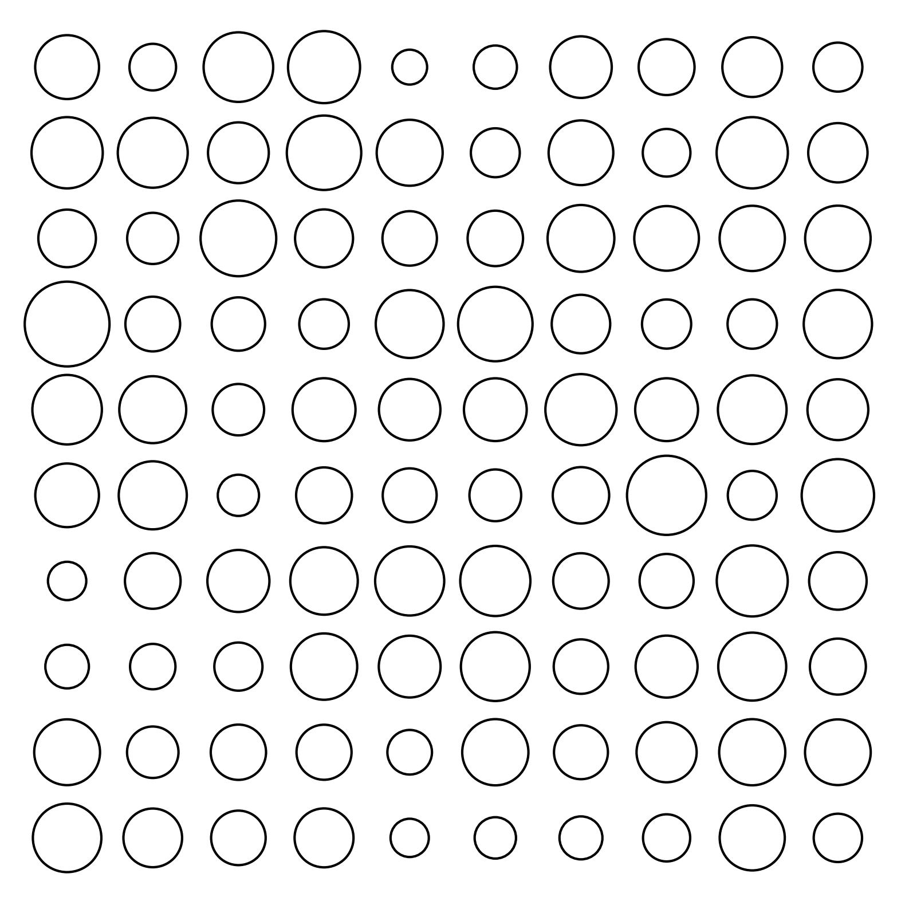
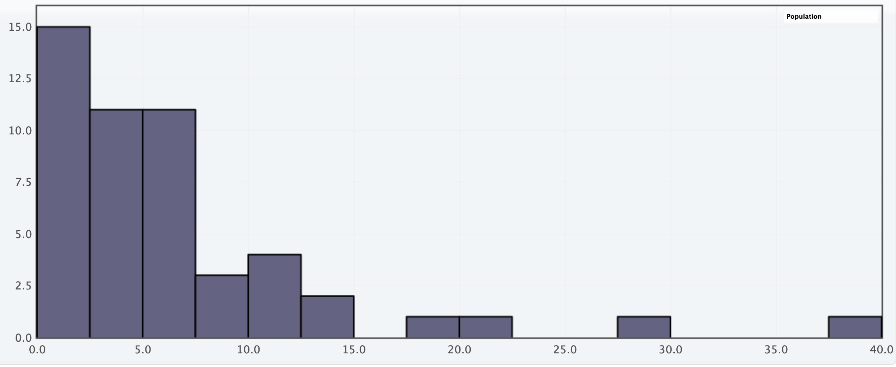
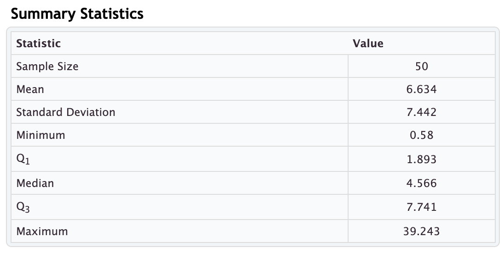

# Measures of Center and Variation

Earlier in our course, we had some experience making quantitative estimates. For example, we attempted to estimate the total surface area of hairs on a human head, the mass of the air in our classroom, and so on. We made these estimates based on **theoretical** assumptions, such as how many hairs are on a human head or the density of air of the room. These estimates are theoretical because no attempt was made to collect information (data) to confirm these quantities.

We will now turn our attention to estimates based on information that has been collected, commonly called **data**.

Another way our estimates will differ in this section is that we will be making quantitative estimates about a single value that describes a group of cases. For example:

- How tall are the students in this class?
- How big are the classes at my university?
- What is the human body temperature?

The examples above are all describing a single quantitative variable. When we seek to understand a single quantitative variable, there are two general questions we are concerned with:

- What is the "typical" value in the data? We call this a **measure of center**, or a **measure of central tendency**.
- How much variation is there in the values in the data?

The typical value will usually be represented by the mean (average) or the median (the center value). The choice of which is more appropriate depends on the **shape of the distribution**. Is the data uniformly distributed, or do some values occur more often than others? If there are values that occur more than others, for which values are they more concentrated?

The question of how the variation will be measured will largely be decided based on the shape of the distribution. It may involve the **standard deviation**, the **interquartile range (IQR)**, or simply the **range** of the data.

## Characterizing a Body of Data

Let’s say this figure represents a group of organisms. How could we answer the question, “How big are the organisms?”

## Mean or Average

A common measure of center is the mean. If we take a list of data, sum the values, and divide by the number of data values, we get the mean, or average. When we refer to a mean from a sample we will use the notation $\bar{x}$. 

## Median

Another measure of central tendency is the median. The median is the value at which half the data has a value below it and half the data has a value above it.

## Standard Deviation

The standard deviation is a measure of how far the data values are typically from the mean. When we refer to the standard deviation from sample data, we will use the notation $s$. We will calculate this value using technology. The standard deviation is most useful when the mean is a good measure of the center.  When the mean is not a good measure of center, we will rely on other measures of variation, e.g. the interquartile range. When we refer the standard deviation of a sample, we use the notation $s$.

## The $z$-score of a data value

We can use the standard deviation to help us understand how unusual a value $x$ is with respect to the set values for a quantitative variable. The $z$-score is computed $$z=\frac{x-\bar{x}}{s}$$

The $z$-score is the number of standard devations the data value $x$ is from the mean $\bar{x}$. As a general rule, we consider values that are more than 2 standard deviations away (above or below) from the mean to be unusual.

## Interquartile Range

Quantitative data is often divided up by quartiles. This entails dividing the cases into four equal-sized groups. The result of this quartering is often described by the five-number summary: minimum, Q1, median, Q3, and maximum, where Q1 and Q3 represent the 25th percentile and 75th percentile of the data, respectively. To compute the interquartile range, we compute Q3 - Q1.

## Histogram

A common tool for looking at single-variable (univariate) data is a histogram.

A histogram:

- shows data of a single quantitative variable
- shows the value of that data on the x-axis
- divides the x-axis into evenly spaced bins
- shows on the y-axis the number of values in each bin

## Example: Populations of US States

Below is a histogram showing the population of all 50 states in millions. Each bin has a width of 2.5 million. The bins represent the intervals (0, 2.5), (2.5, 5), (5, 7.5), ..., (37.5, 40). The height on the vertical axis shows the number of states that have a population in a particular bin. For example, there are 15 states with a population between 0 and 2.5 million people.

Note: The shape of the distribution above is called **right-skewed**. A right-skewed distribution is characterized by a concentration of values on the lower end of the distribution with a tail indicating fewer cases as the values increase.

Below are some summary statistics:

Note that the mean does not do a great job of describing the population of a typical state since it is closer to Q3 than it is to the median. This is largely due to the influence of the right skew and the large outliers, namely the four states with much larger populations than the other 46. In this case, we would usually rely on the median to describe the population of a typical state.
