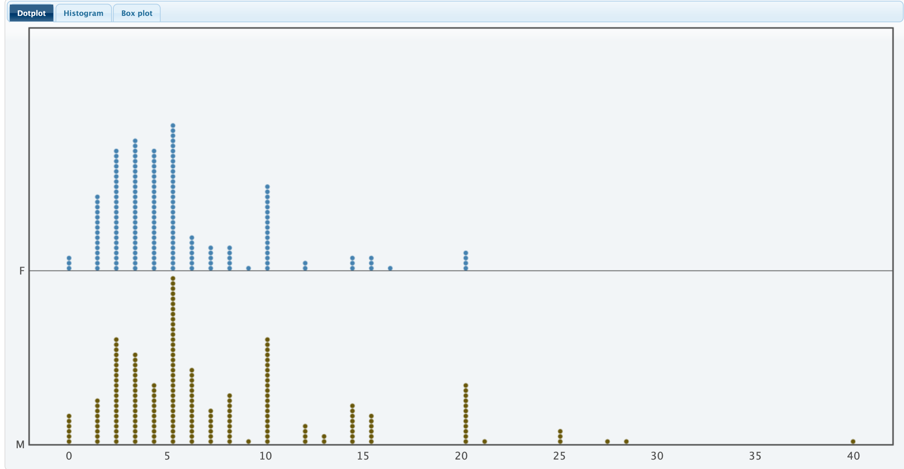
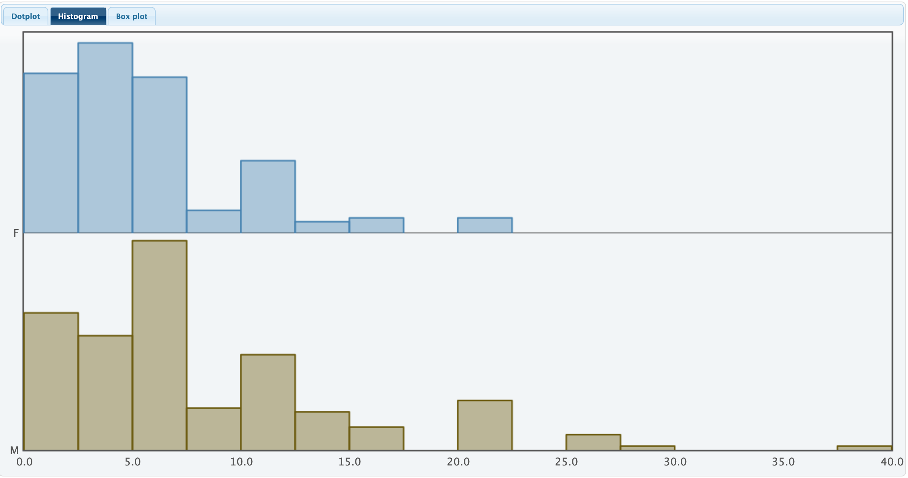
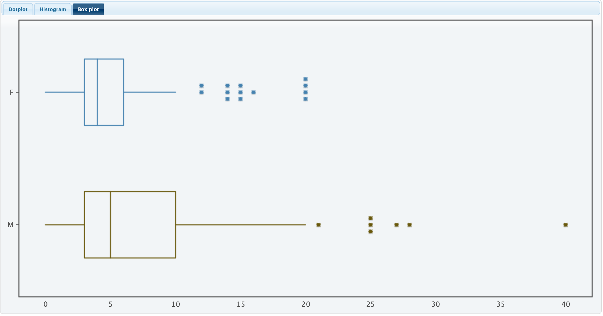
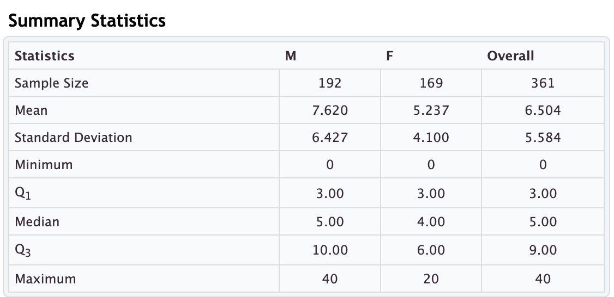

# Comparing a Quantitative Variable across Categories (Groups)

## Comparing Means from Two Independent Groups
Sometimes we want to know if a quantitative variable is being influenced by a categorical variable. Typically, we will do this by comparing the means across the categories, or groups, implied in a categorical variable.
While it is possible to perform this across multiple categories, we will focus on the case where we are comparing means across two groups. Further, we will make this comparison by looking at *the difference in means* between the groups.

### Example
Suppose we have data on all olympic athletes from the 2024 olympic games and we want to know if there is a difference in the average pulse rate for olympic swimmers and olympic track atheletes (runners). The categorical variable would be the type of athlete (track or swimmers) and the quantitative variable would be pulse rate. To compare the pulse rates between the groups (track and swimmers), we could compute the a difference in their mean pulse rates. Specifically, if we let the mean pulse rate for swimmers be $\bar{x}_S$ and the mean for track athletes be $\bar{x}_T$ our difference of mean calulation would be $$\bar{x}_S-\bar{x}_T$$. 

Even though we are using two means in our calculation, we should remember a **difference of means is a single value**. If our difference on means is significantly different from 0, this would provide evidence that the group the athlete is in 
is associated with pulse rate.

## Comparing Quantitative Distributions from Two Independent Groups

While the mean is often the most popular statistic to compare across groups, it often either an incomplete metric, or worse a misleading metric. It can be incomplete in the sense that it only gives a measure of central tendency. It includes no information about variablilty or the shape of the underlying data. We can visualize these relationships using the side-by-side plots. These side-by-side plots may be dot plots, histograms, or boxplots 

### Example The data shown below comparing hours of TV watched per week for males compared to females. Note how much more information we are getting than simply comparing their means.

Note: The asterisks in the boxplots indicate these values are considered outliers in their respective groups.

We can also compare the summary statistics across groups (below)

