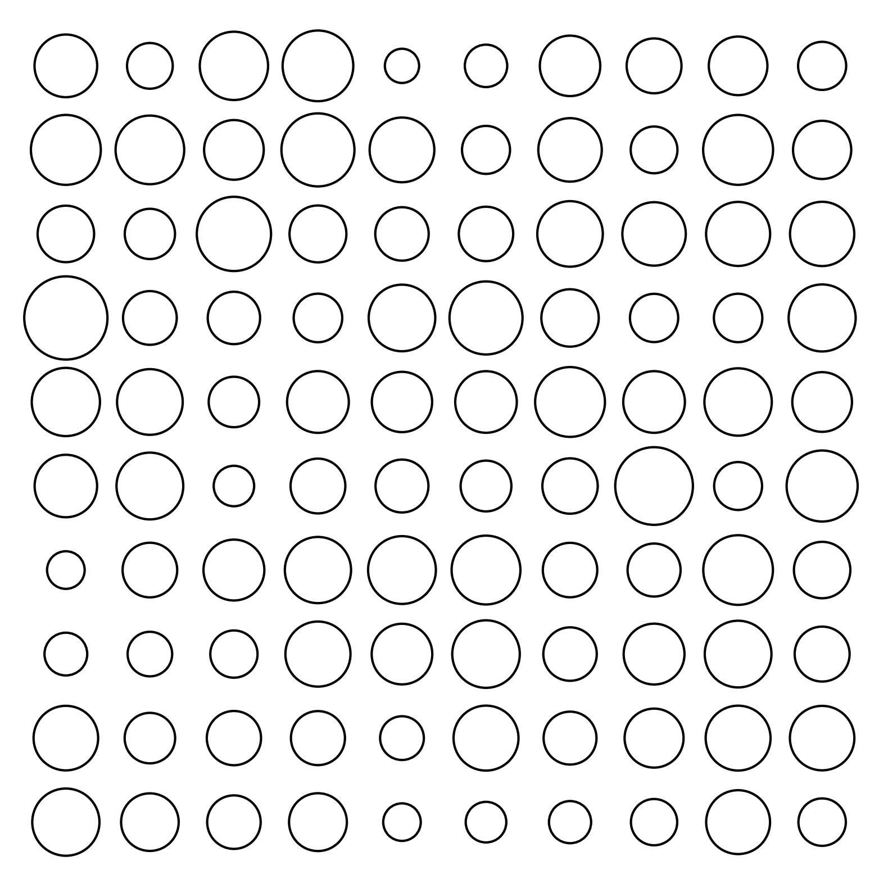
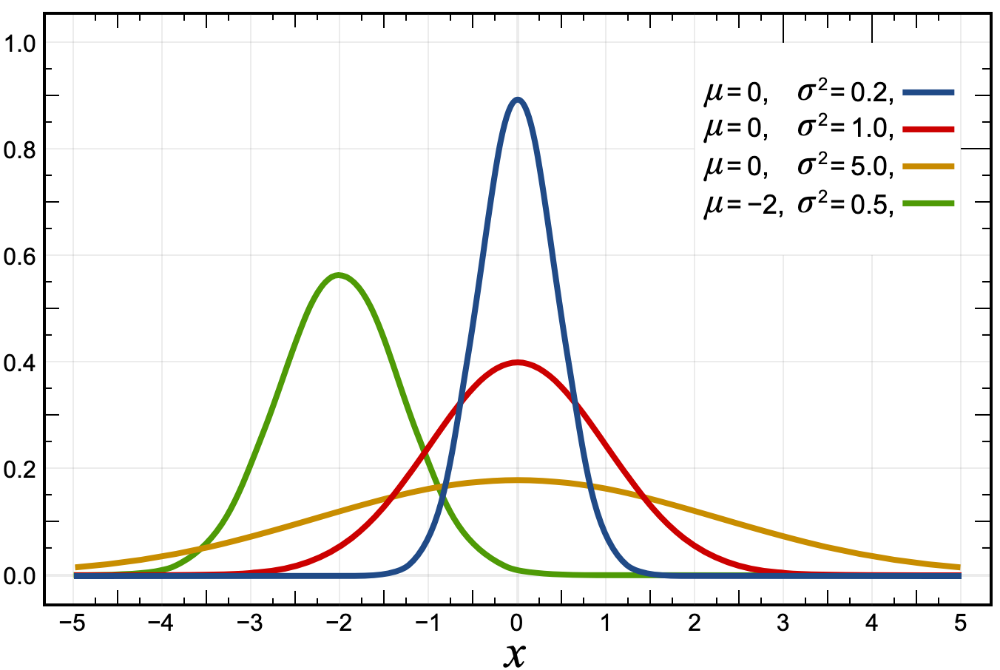

<h1 id="histograms-and-distributions">Histograms and Distributions</h1>

So far, we have focused on single estimates. How much volume is this
tank, how long is this room, etc. Now we ask questions about several
objects at once.

<ul>
<li>How tall are the students in this class?</li>
<li>How big are the classes at my university?</li>
<li>How big are the departments at my university?</li>
</ul>

Here we are interested in the behavior of a single variable. Is it
evenly distributed or are some values more present than others? What are
the largest and smallest values?

<h2 id="characterizing-a-body-of-data">Characterizing a body of
data</h2>

We often ask two questions about data. The first is what is the
central tendency or do the data point to some sort of majority value.
The second is how tightly clustered are the data. Does the data range
widely?

Let’s say this figure represents a group of organisms. How could we
answer the question, “How big are the organisms”?

<figure>

<figcaption aria-hidden="true">Array of objects</figcaption>
</figure>
<h2 id="mean-or-average">Mean or Average</h2>

A common measure of the central tendency is the mean. If we take a
list of data, sum the values, and divide by the number of data we get
the mean or the average.

<h2 id="median">Median</h2>

Another measure of the central tendency is the median. The median is
the value at which half the data has a value below the median and half
the data has a value above it.

<h2 id="standard-deviation">Standard Deviation</h2>

The standard deviation is a measure of how dense or spare the data
are around the central tendency.

<h2 id="histogram">Histogram</h2>

A common tool for looking at single-variable (univariate) data is a
histogram.

A histogram

<ul>
<li>
Shows data of a single quantitative continuous variable
</li>
<li>
Shows the value of that data on the x-axis
</li>
<li>
Divides the x-axis into evenly spaced bins
</li>
<li>
On the y-axis shows the number of values in each bin
</li>
<li>
We should know what values are being counted
</li>
</ul>
<figure>

<figcaption aria-hidden="true">State Areas</figcaption>
</figure>

Here we show how to go from raw data to a histogram.

<figure>

<figcaption aria-hidden="true">State Populations
Alphabetical</figcaption>
</figure>

With the data sorted we can see the median value as the one in the
middle.

<figure>

<figcaption aria-hidden="true">State Populations Sorted</figcaption>
</figure>
<figure>

<figcaption aria-hidden="true">State Populations Histogram</figcaption>
</figure>
<h1 id="normal-distribution">Normal Distribution</h1>

The normal distribution is a model that is a good approximation to a
histogram of data. The real world doesn’t fit it exactly, but the model
provides lots of practical power.

Many measurements and histograms are well-modeled by the normal
distribution.

The x-axis is the value of a measurement and the y-axis is the
relative frequency.

The area under the curve of a (normalized) probability distribution
is exactly one.

The probability of a measurement occurring between two intervals is
the area under the curve between those two intervals.

These probability distributions are models just like a rectangle or a
circle. This probability distribution is usually a mathematical
function.

For example, several normal distributions are shown below according to the function

  

  

Notice our new friend, the number e, showing up.

<h1 id="probabilities">Probabilities</h1>

These tools let you ask questions about how likely it is to observe
events.

For example, if you pick a US adult at random, how likely are they to
be 1.8 meters or taller?

<!-- In the figure above, if you draw a random single sample from the population that the distribution represents, there is a 40% chance that it will be greater than the value represented by the vertical line. -->

<h2 id="types-of-data">Types of Data</h2>
<ul>
<li>Nominal (categorical) data has no quantitative value.
<ul>
<li>Examples include state of birth, blood type, political
affiliation</li>
</ul></li>
<li>Ordinal data has a number and order but isn’t continuous
<ul>
<li>Example: survey question 1 for very unsatisfied, 5 for very
satisfied</li>
</ul></li>
<li>Continuous data: data that can take any value
<ul>
<li>Example: length, mass</li>
</ul></li>
</ul>
<h1 id="imposters">Imposters</h1>

There are things that look like histograms but are not.

<ul>
<li>Time Series</li>
<li>Averaged Time Series</li>
<li>Bar charts with categorical data</li>
</ul>
<!-- move these to the numbers notes -->
