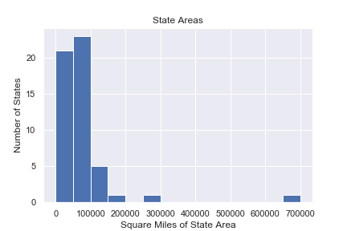

<h1 id="computer-tools">Computer Tools</h1>

We can compute the statistical quantities we have seen before using a
variety of computer tools.

<h2 id="spreadsheets">Spreadsheets</h2>

Excel and Google Sheets usually have identical functions and
syntax

<ul>
<li><a
href="https://support.google.com/docs/answer/3093615"><code>AVERAGE</code></a></li>
<li><a
href="https://support.google.com/docs/answer/3094093"><code>PERCENTILE</code></a></li>
<li><a
href="https://support.google.com/docs/answer/3094095"><code>PERCENTRANK</code></a></li>
</ul>
<h2 id="python">Python</h2>
<ul>
<li><a
href="https://numpy.org/doc/stable/reference/generated/numpy.mean.html"><code>numpy.mean</code></a></li>
<li><a
href="https://numpy.org/doc/stable/reference/generated/numpy.percentile.html"><code>numpy.percentile</code></a></li>
<li><a
href="https://numpy.org/doc/stable/reference/generated/numpy.histogram.html"><code>numpy.histogram</code></a></li>
<li><a
href="https://matplotlib.org/stable/api/_as_gen/matplotlib.pyplot.hist.html"><code>matplotlib.hist</code></a></li>
</ul>

Similar functions are also available in the Pandas python
library.

<h2 id="r">R</h2>
<ul>
<li><a
href="https://www.rdocumentation.org/packages/base/versions/3.6.2/topics/mean"><code>mean</code></a></li>
<li><a
href="https://www.rdocumentation.org/packages/stats/versions/3.6.2/topics/quantile"><code>quantile</code></a></li>
<li><a
href="https://dplyr.tidyverse.org/reference/percent_rank.html"><code>percent_rank</code></a></li>
<li><a
href="https://www.tutorialspoint.com/r/r_histograms.htm"><code>hist</code></a></li>
<li><a
href="https://www.rdocumentation.org/packages/stats/versions/3.6.2/topics/Normal">Normal
Distribution</a></li>
</ul>
<h1 id="plotting-histograms">Plotting Histograms</h1>
<ul>
<li>Determine bins</li>
<li>Sort the data in bins</li>
<li>Count data in each bin</li>
<li>Create bars with heights proportional to the data in each bin</li>
<li>Label axes and format</li>
</ul>
<h1 id="spreadsheet">Spreadsheet</h1>

<a
href="https://support.google.com/docs/answer/9146867?hl=en">Plotting a
spreadsheet in Google Sheets</a>

<h1 id="selecting-data-from-another-sheet-in-the-spreadsheet">Selecting
data from another sheet in the spreadsheet</h1>

Let’s break down a spreadsheet instruction

<code>=percentile(datasheet!AM:AM, 0.5)</code>

<ul>
<li><code>=</code> means do a function</li>
<li><code>percentile</code> is the computer command</li>
<li><code>datasheet</code> is the sheet</li>
<li><code>AM:AM</code> is the chunk of data,</li>
<li><code>0.5</code> is the percentile to look up (median)</li>
</ul>
<!-- 

# Histograms and Distributions

So far, we have focused on single estimates.
How much volume is this tank, how long is this room, etc.
Now we ask questions about several objects at once.

- How tall are the students in this class?
- How big are the classes at my university?
- How big are the departments at my university?

Here we are interested in the behavior of a single variable.
Is it evenly distributed or are some values more present than others?
What are the largest and smallest values?

## Types of Data

- Nominal data has no quantitative value.
    - Examples include state of birth, blood type, political affiliation
- Ordinal data has a number and order but isn't continuous
    - Example: survey question 1 for very unsatisfied, 5 for very satisfied
- Continuous data: data that can take any value
    - Example: length, mass

:::{.instructor}
- Interval data
- Ratio data
:::

## Characterizing a body of data

We often ask two questions about data.  The first is what is the central tendency or do the data point to some sort of majority value.  The second is how tightly clustered are the data.  Does the data range widely?

## Mean or Average

A common measure of the central tendency is the mean.
If we take a list of data, sum the values, and divide by the number of data we get the mean or the average.

## Median

Another measure of the central tendency is the median.
The median is the value at which half the data has a value below the median and half the data has a value above it.

## Standard Deviation

The standard deviation is a measure of how dense or spare the data are around the central tendency.

## Histogram

A common tool for looking at single-variable (univariate) data is a histogram.

A histogram

- Shows data of a single quantitative continuous variable
- Shows the value of that data on the x-axis
- Divides the x-axis into evenly spaced bins
- On the y-axis shows the number of values in each bin

## Probability Distribution

A probability distribution is a model that explains the relative probability of different events happening.
The probability distribution is an ideal mathematical model.
The real world doesn't fit it exactly, but the model provides lots of practical power.

The x-axis is the value of a measurement and the y-axis is the relative frequency.

The area under the curve of a (normalized) probability distribution is exactly one.

The probability of a measurement occurring between two intervals is the area under the curve between those two intervals.

These probability distributions are models just like a rectangle or a circle.
This probability distribution is usually a mathematical function.

For example, the gaussian distribution is given by

$$f = \frac{1}{\sqrt{2\pi\sigma^2}}e^{-(x-\mu)^2/\sigma^2}$$

Notice our new friend, the number e, showing up.

## Relative probability

If you can calculate or estimate the area under the curve of a probability distribution, you can predict the probability of an event occurring.

## Percentile

As we ask about the relative probabilities in a distribution, we use the percentile.
The Xth percentile is the value Y at which X percent of the data has a value below Y.
We interpret this as the area below a value on a probability distribution.
Histograms and distributions show us the range of frequency of values of an ensemble of things.
For example, the heights of students in a classroom.

Histograms have

- A continuous value on the x-axis
- A frequency value on the y-axis
- A definition of the population's members being measured

A distribution is the name for a "continuous" histogram.
The interpretation of distributions and histograms is usually very similar.

You can find other examples of age histograms
[here.](https://www.census.gov/newsroom/blogs/random-samplings/2016/06/americas-age-profile-told-through-population-pyramids.html)

:::{.instructor}

TODO: work out all the probabilities and write out formulas

Bayesian example

The authorities have identified a suspect in a crime.
We assume that 10% of suspects identified by authorities are actually guilty.
How do the odds of guilt change if the suspect maintains their innocence?

$$P(guilt|deny) = \frac{P(innocent claim)P(guilt)}{P(innocent claim)}$$

The prior, probability of guilt, is 10%.
The evidence is their statement of innocence.
The probability of maintaining innocence is 99.8%
Probability of saying not guilty given guilt is 99.9%.

The ratio of these two very high probabilities is nearly one, so this evidence does nothing to update our priors.

|               | guilt  | innocence  | total |
|-              |-       |-           |-      |
| deny          |   99   |   899      |  998  |
| admit         |    1   |     1      |    2  |
| total         |  100   |   900      | 1000  |

TODO: run for if you get an admission of guilt.

:::

:::{.instructor}

- most of these ask students to go backwards and find
- could be good to give nice even numbers and ask to find the CDF
- this is a warmup for
- TODO: add a problem to sketch the CDF for uniform and triangular distributions using areas

We'd like to incorporate case studies that connect data distributions to spatial representations.

- possible case study: cal enviroscreen
- possible case study: red states blue states -> red counties and blue counties
- possible case study: population densities map

:::

:::{.instructor}

- It may be valuable to plot a sweep of the area and a CDF plot simultaneously in an animation.
- CDF given a value, what percent of data lies below?
- PPF give a probability, what is the value?

:::

-->
