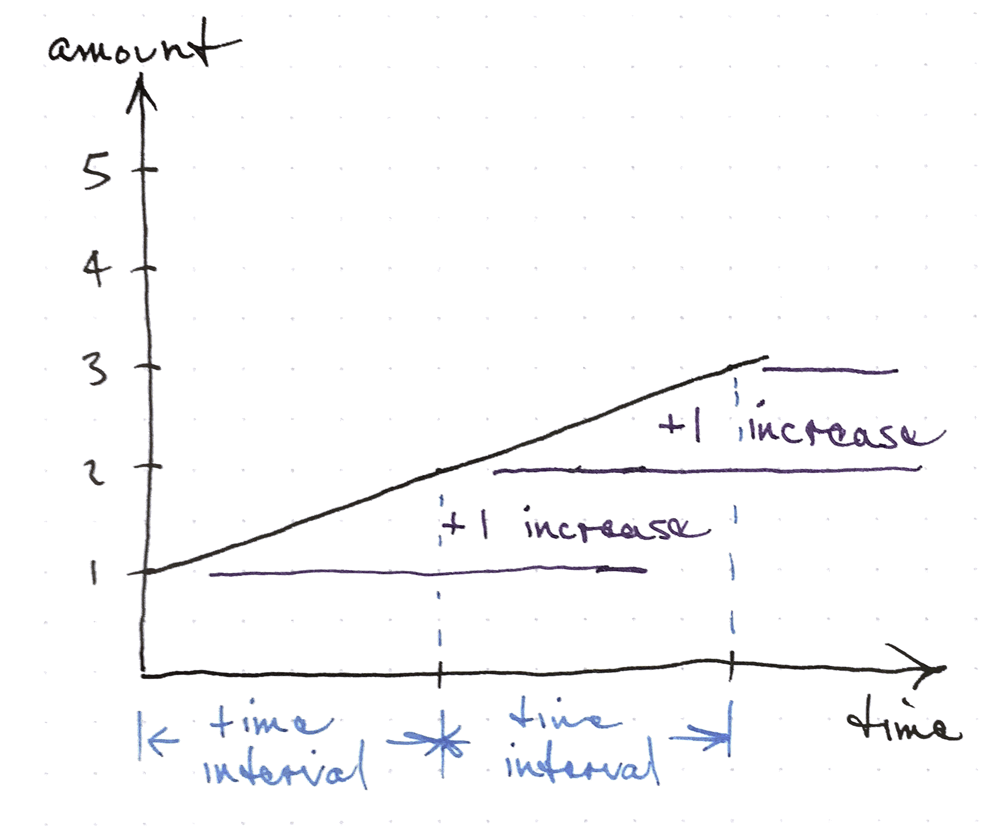
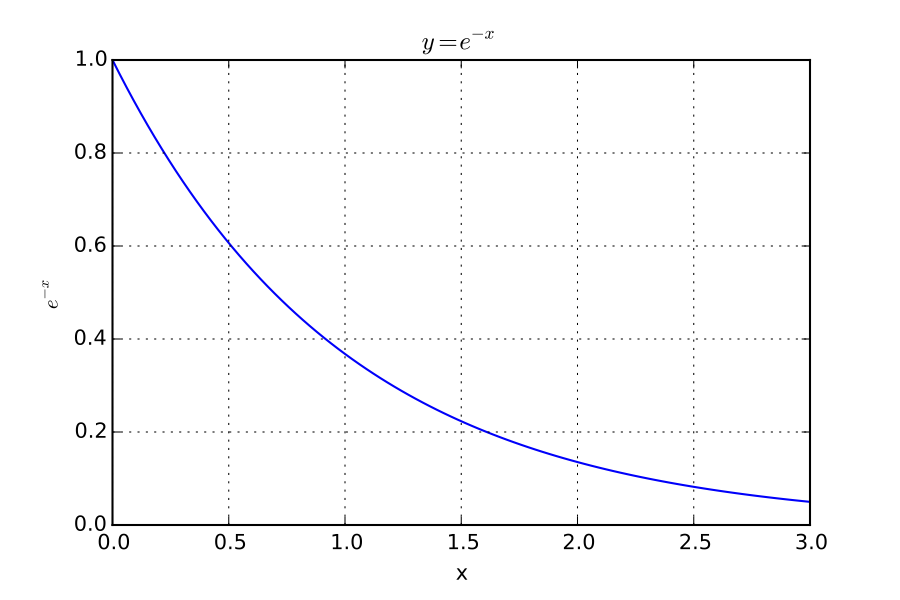

# Exponential Concepts

Quantities the that change exponentially are encountered in many different areas that employ mathematical modelling.

For example, a population or bank balance is multiplied by a number each time a year goes by.

Exponential models fit these things well:

- Populations
- Contagious disease spread
- Credit card balances
- Viral videos
- [Piano Keyboard](http://pianointune.blogspot.com/2010/08/musical-note-frequencies.html)

# Exponential notation

You've probably seen notation like $x^2$ or $x^3$ several times before.
In exponential notation, our symbol for a variable, $x$ is in the exponent.

For example $2^x$ or $3^x$.

Recall that $1 = 2^0$, $2 = 2^1$, $2 \cdot 2 = 2^2 = 4$, etc.
So, $2^x$ means to multiply 2 by itself x times.

# Exponential Examples

## Folding paper

- Zero folds $2^0$ makes one sheet thick
- One fold $2^1$ is two sheets thick
- How many times can you fold?
- How can we express the number of pages by the number of folds?
- Can we write out the pattern?

<!-- my max is six -->

$$ \textrm{pages} = 2^{\textrm{folds}} $$

## Rabbits

- start with two
- wait one year
- now we have double (4)
- wait another year
- now we have eight (8)
- how many in 5 years?

The number of rabbits at the start of the generation (starting with
generation zero) is
$$ \textrm{rabbits} = 2^{\textrm{generations+1}} $$

## Money grows the same way

- Start with $1000
- Grow by 10%
- Now $1100
- Grow by 10%
- Now $1210

$$ 1000 \cdot (1+0.10)^{years} $$

## Piano Scale

# Exponential Growth

# Constant Growth

This is in contrast to linear growth where if you wait for the amount to increase by a fixed amount, the amount will always increase by that fixed amount in that amount of time.

For linear growth, the slope of the function is a number that does not change along the function.

## Exponential growth

## Doubling Time

Exponential growth means that if you measure how long it takes a quantity to double, the time to double from any current amount will be the same.

There is nothing special about the doubling time, it is just a convenient ratio of 2:1.
Keep in mind that the ratio between the two points is the same for any two equal time intervals.

<!-- feels like clumsy phrasing -->

## The Doubling Function $y=2^x$

## Exponential Decay
What if instead of doubling every year, something fell by half each
year?

<!-- tear a piece of paper in half repeatedly -->

## Halving

## Exponential Decay

## The exponential function $y=e^x$

Even though $y=e^x$ is just one function in the class of exponential functions, $e^x$ is often called **the** exponential function because it has the unique property that the rate of change of $e^x$ for any $x$ is equal to the value of $e^x$.

Using the language of calculus, the function whose output $y=f(x)$ is equal to the slope of the tangent line $f'(x)$ is $f(x) = e^x$.

## Exponential growth
- The rate of change is proportional to the total number
- The doubling time is constant over the entire range
- What things exhibit these characteristics?

# Definitions

## Which gets bigger faster?
$x^2$ or $2^x$

Draw these out in your notebook to see

<!-- note you are moving the x from the base to the exponent -->

## Exponential decay
- A quantity loses the same fraction of itself for a given time interval
- Nuclear waste
- Toxins in a body
- The water in a stream (baseflow)

# Further Reading

- [NY Times coronavirus graphing](https://www.nytimes.com/2020/03/20/health/coronavirus-data-logarithm-chart.html)
- [Coronavirus Plots](https://github.com/dsoto/simple-covid-models)

