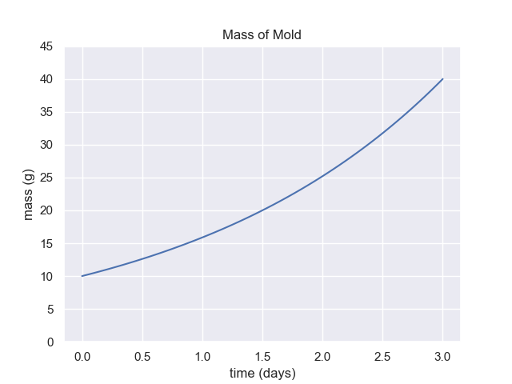
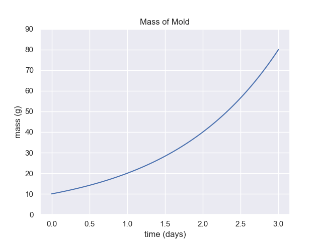
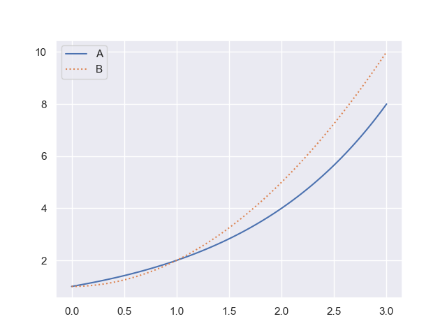

#Exponential Relationships Exercises
## 1 Exponential Course Notes

Read through the exponentials section of our course notes.

- What does it mean to if we say the relationship between two variables is linear?  
- What does it mean to if we say the relationship between two variables is exponential?    

## 2 Exponential Article

Find and link to an article of a topic of interest discussing exponential growth.

- What is the article about?  
- What features of the topic show that it fits the definition of exponential growth?  

## 3 Exponentials Metacognition

Look over the topics and exercises we have done so far.

- Which topics do you have the strongest understanding of?  
- Which topics do you not understand yet?  

## 4 Demonstrate Doubling Time

Doubling time is the amount of time it takes a quantity to double. 

For the graph above, demonstrate by showing at least 3 intervals on the graph, that the doubling time is 1.5 days.

## 5 Use Formula to Extrapolate

The mass of mold on my pizza is 2 grams right now. Mold scientists tell me it will grow according to the function

$$
\text{Mold (grams)} = 2 e^{0.08 t}
$$

where $t$ is the number of hours from now.

How many grams of mold will there be in twelve hours?

## 6 Extrapolate from Graph

For the graph above, if the growth rate does not change, what is the expected mass of mold after 6 days total.

## 7 Doubling Time Extrapolation

For the graph above what is the mass of mold on day 6? (Time equals 6.0)

## 8 Which is Exponential (Linear Scale)

Which of the above graphs is exponential?

- A  
- B  
- Both A and B  
- Neither A nor B  

Explain the reasoning behind your selection.

# For 9-13 you may use the following shortcut for finding $k$. Given the form $A=A_0b^t$ we can use $$k=ln(b)$$ to determine the $k$ value in the form $A=A_0e^{kt}$. (Warning: this will only work if your exponent $t$ is not multiplied (or divided) by a value.)

## 9. Carbon-14 Half-Life

Carbon-14 has a half-life of 5730 years.

a. Use the shortcut shown above problem 9 to find the value of $k$ and write a model in the form  

   $A(t) = A_0e^{kt}$

   For any decimal approximations in your calculations use at least 6 decimal places. 

b. Assume we have an initial amount of 113 grams of Carbon-14. Write the revised model.

c. How much Carbon-14 will remain in 8000 years? Use your model to the amount to 2 decimal places.

d. Research the discovery of Carbon-14 as a form of dating organic material. Write a 200 word summary that includes how this method is used to determine the age of organic materials, the name of the person who discovered the method (including their hometown!), and the time limitations on this method of dating. 

---

## 10. Interpreting the Decay Constant

A radioactive element follows:

$A(t) = A_0e^{−0.031t}$

a. Is this growth or decay? Explain how you know.

b. What percent of the substance remains after 1 year? 

c. What is the approximate yearly percent decrease?

---

---

## 11. Converting from Base b to Base e

A population model is $P(t) = 800(1.12)^t$

a. Rewrite the model in the form $P(t) = 800e^{kt}$. You may use shortcut for $k$. Approximate $k$ to 4 decimal places.

b. Explain what $k$ represents in context.

---

---

## 12. Building a Model from Percent Growth

A population increases by 7% per year.

a. Write a model using base $b^t$.

b. Convert the model to the form $A(t) = A_0e^{kt}$. You may use shortcut for $k$. Approximate $k$ to 4 decimal places.

---

## 13. Conceptual Understanding

Answer in complete sentences.

a. Explain how can every model of the form $A_0b^t$ be rewritten as $A_0e^{kt}$?

b. Suppose we have two models $P(t)=P_0e^{k_1t}$ and $k<0$, and $Q(t)=Q_0e^{k_2t}$ and $k_2<k_1$, what does that tell us about how these models differ with regards to their rate of change? In other words, if one model has a `more negative' $k$ value than the other, what does this mean?

c. Explain why we might prefer the form $A_0e^{kt}$ to $A_0b^t$ when trying to understand exponential change. Mention the interpretation of $k$ in your explanation. 

