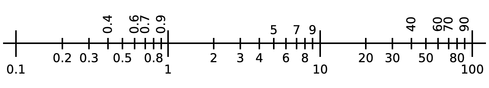
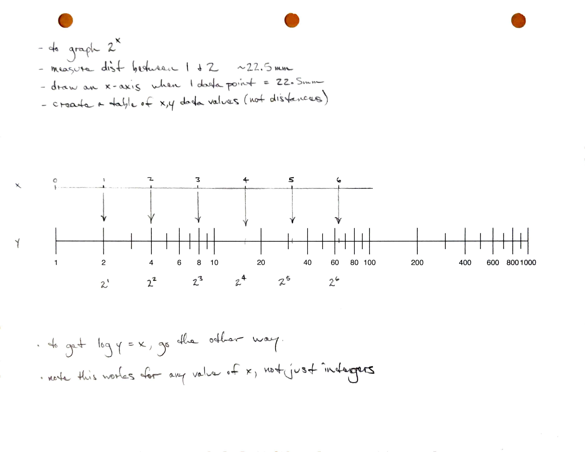
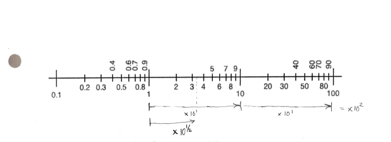
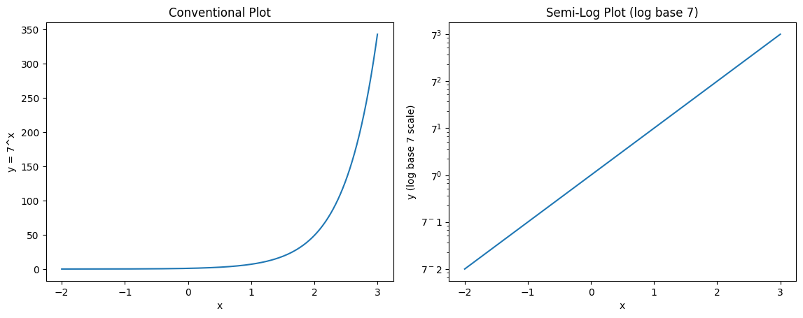

# Logarithmic Scales

When you look at the vast majority of graphs and maps, moving a distance corresponds to adding a number.
The ratio of distance to data does not change and this is called a linear scale.

With a logarithmic scale, moving a distance corresponds to a multiplication.
Also, moving that distance corresponds to multiplying by the same number anywhere on the scale.

Here is an example of a logarithmic scale:

You can use a ruler or a marks on a piece of paper to convince yourself that the same distance results in the same multiplication or division.

Notice how this behavior of the logarithmic scale is different and similar to the behavior of a linear scale.

# Logarthmic scales create exponential graphs

# Exponential Notation

You've probably seen notation like $x^2$ or $x^3$ several times before.
In exponential notation, our symbol for a variable, $x$ is in the exponent.

For example $2^x$ or $3^x$.

Recall that $1 = 2^0$, $2 = 2^1$, $2 \cdot 2 = 2^2 = 4$, etc.
So, $2^x$ means to multiply 2 by itself x times.

# Fractional Powers

Here we see that if we go a distance (about 50mm on the original paper drawing) we multiply by $10^1$.
Going twice that distance multiplies by $10^2$.
Going half that distance multilies by $10^{1/2}$.

# Exponentials and Logarithms are Inverses of on Another

Observe that we can rewrite the equation $y=2x$ as $\frac{y}{2}=x$ because the division of $y$ by 2 on the left side of the equation is the inverse of the multiplication of $x$ by 2 on the right side. Because the logarithm is the inverse of an exponential function, we can do something similar to rewrite exponential equations as logarithmic equations.

For example, we can rewrite the equation $y=2^x$ as a logarithm. When we do this, it is an important to remember two things: 

1) **logarithms are exponents**
2) The base of our exponent is the base of the logarithm. 

Using these two observations we have that $y=2^x$ is equivalent to $\log_2y=x$. Note that the log is equal to $x$ which is the exponent in $2^x$

We can use this relationship to help us solve exponential equations. 

For example, let's say you want to solve $75 = 10^x$ for $x$. We can rewrite this as $\log_{10}100=x$.  Note that base-10 logs are known as the "common log". The `log` button on your calculator corresponds to base-10, So we can use our calculator to find that $\log 75\approx 1.875$. You can confirm that $10^{1.875}\approx 75$.

When we use the number $e$ we use the natural log $\ln$. For example, we could solve $104=5e^t$ for $t$ as follows.

$$\frac{104}{5} = e^t$$ 

$$t= \ln(\frac{104}{5})$$

$$t\approx 3.035$$

For any other number $b$, if $y = b^x$ then $\log_b y = x$.

# Semi-log Plots
A semi-log plot is a graph in which one axis is scaled logarithmically while the other axis remains linear. Most commonly, the y-axis is logarithmic and the x-axis is linear. This type of plot is useful when data span several orders of magnitude (powers of 10) or when the relationship between variables is exponential. On a semi-log plot, exponential growth or decay appears as a straight line, which makes trends easier to identify and analyze. 

For example, the exponential function $y=7^x$ can be shown using a linear $y$ axis (below left). If we show the values in the $y$-axis using a log scale we see the semi-log plot (below right).

