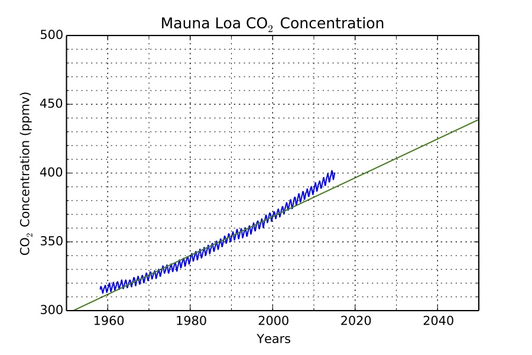
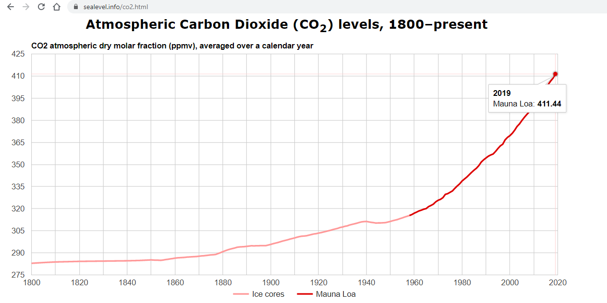

<h1 id="linear-exercises">Linear Exercises</h1>

<h1 id="ellenberg-chapter-1">1. Ellenberg Chapter 1</h1>

Read the <a href="https://www.dropbox.com/s/8ue7ol2e1sy5ol4/HNTBW-CH1.pdf?dl=0">
first chapter of <em>How Not to Be Wrong</em></a>. Focus on the difference
between linear and non-linear relationships.

<ul>
<li>Create a list of at least 10 pairs of quantities (environmental, social, economic, biological, etc.) that you believe may be associated or correlated.</li>
<li>For each pair, clearly state:
  <ul>
    <li>Which quantity you believe is the independent variable.</li>
    <li>Whether an increase in the independent variable would likely cause an increase or decrease in the other variable.</li>
    <li>Whether you believe the relationship is likely linear or non-linear (brief justification required).</li>
  </ul>
</li>
<li>Your final submission should include exactly 10 clearly written examples.</li>
</ul>

<h1 id="linear-relationships">2. Linear Relationships</h1>

Revisit your list from Exercise 1. You may revise your examples.
Select at least 3 relationships that you believe could reasonably be modeled as linear.

For each of the 3 selected relationships, explicitly provide:

<ul>
<li>The quantity on the x-axis (independent variable), including:
  <ul>
    <li>Units (e.g., dollars, meters, years)</li>
    <li>Dimensions (e.g., length, time, mass, currency)</li>
  </ul>
</li>
<li>The quantity on the y-axis (dependent variable), including:
  <ul>
    <li>Units</li>
    <li>Dimensions</li>
  </ul>
</li>
<li>The units and dimensions of the slope (show how you determined them).</li>
<li>A clearly written quantitative question that this linear model would allow you to answer.</li>
</ul>

<h1 id="linear-notes">3. Linear Notes</h1>

Read the notes for this section carefully.

<ul>
<li>Explain in complete sentences how to determine the units and dimensions of a slope.</li>
<li>State whether the slope changes in a linear graph and justify your answer.</li>
</ul>

<h1 id="unit-conversion-graph">4. Unit Conversion Graph</h1>

Represent the conversion from miles to meters as a linear graph.

<ul>
<li>Draw a clearly labeled graph with:
  <ul>
    <li>x-axis labeled “Miles”</li>
    <li>y-axis labeled “Meters”</li>
  </ul>
</li>
<li>Show values from 0 to 10 miles on the x-axis with labeled tick marks.</li>
<li>Include corresponding meter values on the y-axis.</li>
<li>Explicitly show how the slope of the line represents the unit conversion factor.</li>
<li>Demonstrate (in writing) how to use your graph to estimate the number of meters in a given number of miles.</li>
</ul>

<h1 id="taco-estimation">5. Taco Estimation</h1>

Model the taco estimation problem as a linear relationship.

<ul>
<li>Draw a graph where:
  <ul>
    <li>x-axis = number of students (0–20,000)</li>
    <li>y-axis = number of tacos</li>
  </ul>
</li>
<li>Clearly label all axes and include units.</li>
<li>State the units of the slope and explain what the slope represents in context.</li>
<li>Write the linear formula and explain how it corresponds to your graph.</li>
<li>Show how to use the graph to estimate the number of tacos for a specific number of students.</li>
</ul>

<h1 id="pizza-formula">6. Pizza Formula</h1>

A Rafy’s large cheese pizza costs &dollar;16 plus &dollar;2 per topping.

<ul>
<li>Write a clearly defined linear formula for total cost as a function of number of toppings. Define your variables.</li>
<li>Sketch a graph showing price versus number of toppings (0–4).</li>
<li>Label axes and include units.</li>
</ul>

<h1 id="modern-keeling-curve">7. Modern Keeling Curve</h1>

Examine the <a href="https://keelingcurve.ucsd.edu/">Keeling Curve</a>.

<ul>
<li>Describe what the slope represents physically and why it is important.</li>
<li>Estimate the average slope (ppm per year) from 2010 to 2020. Show how you calculated your estimate.</li>
<li>Assuming the 2010–2020 rate continues linearly, calculate the projected CO₂ concentration in 2050. Show your work.</li>
</ul>

<h1 id="early-20th-century-keeling-curve">8. Early 20th Century Keeling Curve</h1>

<ul>
<li>Describe how the slope from 1700 to today changes over time.</li>
<li>Estimate the average slope (ppm per year) from 1900 to 1950. Show your calculation.</li>
<li>If the 1900–1950 rate had continued unchanged, calculate what today’s concentration would be. Show your work.</li>
<li>Briefly compare this projection to actual modern values.</li>
</ul>

<h1 id="taco-estimation-graph">9. Taco Estimation Spreadsheet</h1>

<ul>
<li>Create a spreadsheet with:
  <ul>
    <li>One column labeled “Number of People”</li>
    <li>One column labeled “Number of Tacos”</li>
  </ul>
</li>
<li>Use a formula (not manual typing) to calculate tacos. If you don't know how this is done check out <a href="https://www.youtube.com/watch?v=llkP9DxRAPI"> this tutorial</a></li>
<li>Create a graph using these two columns.</li>
<li>Upload a screenshot that clearly shows:
  <ul>
    <li>Your formulas</li>
    <li>Your graph</li>
  </ul>
</li>
</ul>

<h1 id="unit-conversion-scale">10. Unit Conversion Scale</h1>

<ul>
<li>Create a hand-drawn linear scale converting between pounds and kilograms.</li>
<li>Mark tick marks at clear, round-number intervals.</li>
<li>State the numerical conversion factor you are using.</li>
<li>Use a spreadsheet to calculate the exact page distance for each tick mark and include this calculation.</li>
</ul>

<h1 id="absolute-temperature-converting-scale">11. Absolute Temperature Scale</h1>

<ul>
<li>Draw a linear conversion scale between Celsius and Fahrenheit.</li>
<li>Mark round-number tick marks on both scales.</li>
<li>State the conversion formula.</li>
<li>Show how you accounted for the different zero points.</li>
<li>Demonstrate your calculations for positioning tick marks.</li>
</ul>

<h1 id="linear-relationship">12. Linear Relationship in the News</h1>

<ul>
<li>Select a news article discussing a relationship between two variables.</li>
<li>Include the article title and working link.</li>
<li>Identify the two variables and state their units and dimensions.</li>
<li>Sketch a graph (assume linear locally if needed) and label axes.</li>
<li>Write ~150 words explaining what quantitative questions this relationship allows you to answer.</li>
</ul>

<h1 id="spreadsheet-extrapolation">13. Spreadsheet Extrapolation</h1>

<ul>
<li>Choose:
  <ul>
    <li>A slope between 2 and 5</li>
    <li>A y-intercept between 2 and 5</li>
  </ul>
</li>
<li>Write your linear equation clearly.</li>
<li>Use a spreadsheet to compute y-values for x = 0 to 10.</li>
<li>Create a graph of your data.</li>
<li>Use spreadsheet tools (trendline or formula) to confirm the slope and intercept match your chosen values.</li>
<li>Use your spreadsheet to extrapolate values for x = 20 and x = 30.</li>
<li>Upload a 30–60 second video explaining your spreadsheet, equation, and extrapolation.</li>
</ul>
