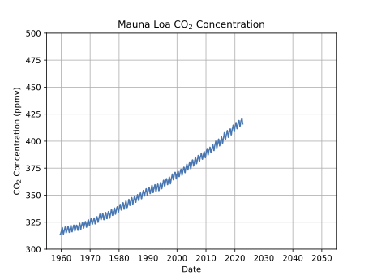

<h1 id="the-linear-function-as-a-tool">Extrapolation and Fits</h1>

If a linear model is appropriate for the situation we are trying to
analyze, there are several mathematical techniques that may be of
interest.

<ul>
<li>Extrapolation</li>
<li>Interpolation</li>
<li>Regression or Fitting</li>
</ul>
<h2 id="extrapolation">Extrapolation</h2>

Extrapolation is the use of a linear model to make a prediction.
Usually, our linear model is valid over a certain range. In an
extrapolation, we assume the model is valid beyond that range and ask
what our model would predict.

There are two approaches to extrapolation

<ul>
<li>doing a calculation based on the slope and an existing data
point</li>
<li>using a ruler or other visual aid on a graph to estimate</li>
</ul>
<h2 id="interpolation">Interpolation</h2>

Interpolation is the use of a linear model to make a prediction. If
we have data on both sides of our region of interest, we can make
predictions in between.

<h2 id="linear-fits-or-regression">Linear Fits or Regression</h2>
<ul>
<li>If we have a bunch of data that is roughly linear, we can use a
linear function as a model</li>
<li>The process of finding this linear model from the data is called
regression or fitting</li>
</ul>
<h2 id="linear-extrapolation">Linear Extrapolation</h2>
<ul>
<li>If we assume a relationship, we can predict its value in the
future</li>
</ul>
<h2 id="extrapolation-formula">Extrapolation Formula</h2>

It is helpful to be able to see how the pieces of the extrapolation
formula correspond to a visual picture.

<ul>
<li>Find the slope of the known portion of the graph so you have the
relationship between x and y.</li>
<li>You are calculating the distance on the x-axis between your last
known data and the point you want to compute. This will be the run in a
slope triangle.</li>
<li>Multiplying this x-distance by the slope will give you the rise in a
slope triangle.</li>
<li>Adding this to the last known y-value will give you the
corresponding value of y for the x you chose.</li>
</ul>

<h1 id="mauna-loa-data">Mauna Loa Data</h1>

