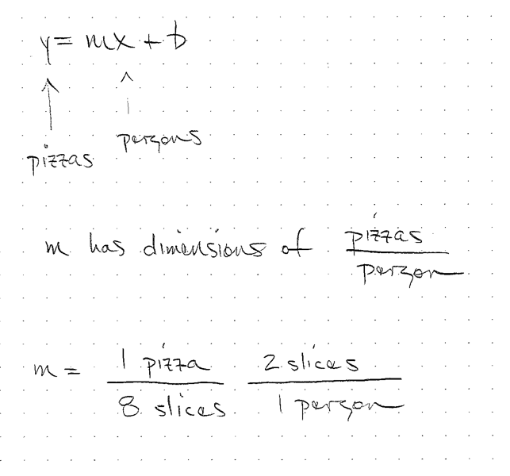
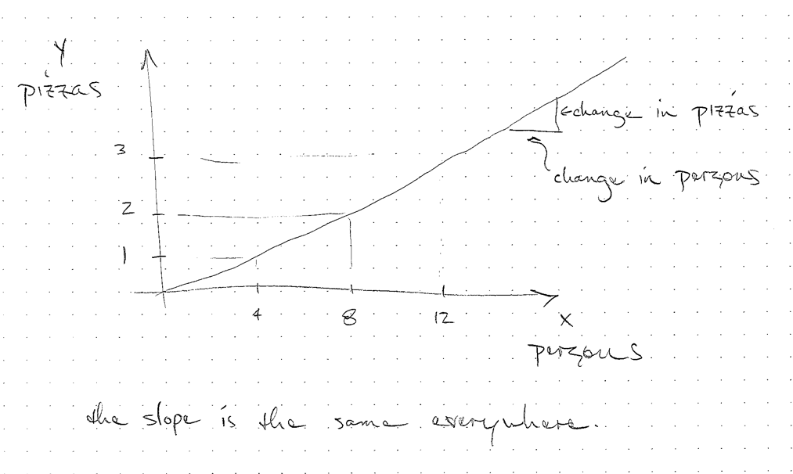

# Linear Functions

When we are reading most graphs and maps, there is a linear, proportional relationship between the distance on the page or screen and the data.

- On a map, there is a bar showing the scale length of a mile and a kilometer.
- On a graph, there is a relationship between the length on the page and the data.

## Proportional Relationship

- If $b=0$ we say $x$ and $y$ are proportional
- If $x$ is proportional to $y$ we can write $x\propto y$
- A proportional relationship is a linear relationship
- The independent variable is zero when the dependent variable is zero
- If two quantities are proportional, the valquantities of the two properties are related by a constant factor
- Most of our unit conversions are proportional relationships

# Drawing a Graph

When you draw a graph, think about what you are communicating to your audience.

- What is the story you are trying to tell?
- What is the range of data on the x and y axes?
- Where should you place ticks and tick labels
- Draw out axes, ticks, labels
- Draw the data points on the graph
- Decide if shapes, color, and size would help you 
- Draw the trendline
- Draw any annotations

# Linear equation
$$ y = mx + b $$

## Estimations

## Estimations

## Linear equation

## Linear equations
- If $b \neq 0$ it is a linear function.
- For both, a change in $x$ has a change in $y$ no matter the value of x.

## Estimations
- The estimations we have used so far have assumed linear models
- We often have a quantity $x$ and we have to figure out $m$ to get $y$.

## Linear Fits

- If we have a bunch of data that is roughly linear, we can extract a model

## Unit Conversions

- In a unit conversion we can plot the starting units on the x-axis as the dependent variable.
- We can plot the ending units on the y-axis as the independent variable.
- The "unit conversion" is the slope of this line. 

# Details

## Intercepts

- What types of models are likely to have an intercept?
- What models will have an intercept of zero?

# Linear Models

Name some models or phenomenon that exhibit a linear relationship.

- Taxi cab ride
- Pizza price with toppings
- Electricity bill

## Circle questions
- Is the circumference of a circle is proportional to its radius?
- Is the constant of proportionality the same for all circles?
- Is the area of a circle proportional to its radius?

<!--
no, it is proportional to the radius squared
sometimes we may say it is proportional, but not by the math definition
-->

