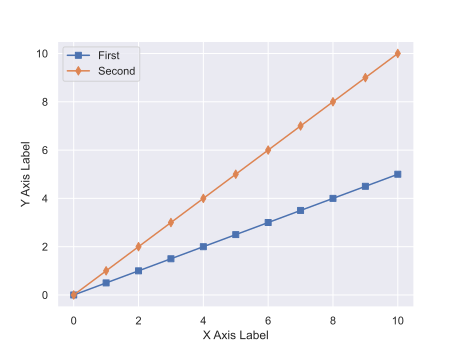

# Linear Graphs

We often draw graphs with linear scales for x and y that depict a linear relationship.

# Parts of a Graph

- Legend: shows what each line and symbol represents
- Symbols (square and diamond): show the location of the data points
- Line: helps visualize the overall shape of the points
- Ticks and Tick Labels: show the linear scale of the x and y axes
- Color: helps reader distinguish 

# Drawing a Graph

When you draw a graph, think about what you are communicating to your audience.

- What is the story you are trying to tell?
- What is the range of data on the x and y axes?
- Where should you place ticks and tick labels
- Draw out axes, ticks, labels
- Draw the data points on the graph
- Decide if shapes, color, and size would help you 
- Draw the trendline
- Draw any annotations

# Regression

If you have data and you want the computer to find the best slope, you use a technique called regression.[Check out Desmos](https://help.desmos.com/hc/en-us/articles/4406972958733-Regressions)
 for a nice interface.
- In most graphs, there is an option to show the trendline and display the equation of the trendline
- You can also show $r$ which is a measure of how closely the data matches the trendline
- There are also functions for the slope and intercept that you can use without a graph

