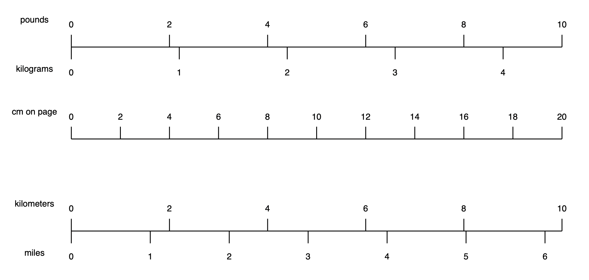
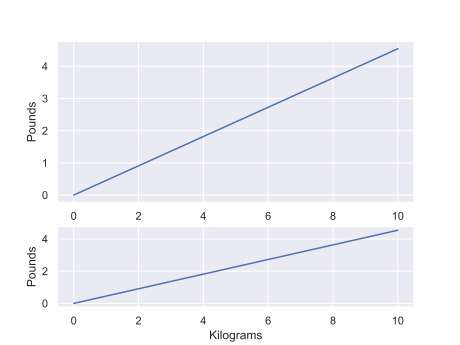
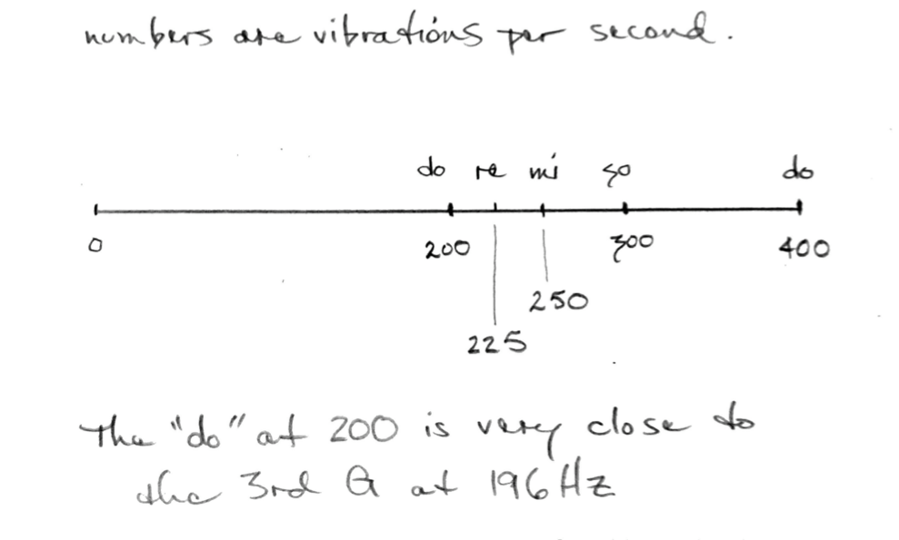
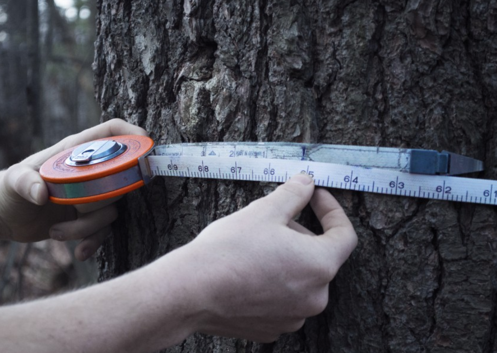

# Linear Scales

> There are these two young fish swimming along, and they happen to meet an older fish swimming the other way, who nods at them and says, “Morning, boys. How’s the water?” And the two young fish swim on for a bit, and then eventually one of them looks over at the other and goes, “What the hell is water?” -- David Foster Wallace

The linear scale is so common that we may not realize what it is.

When we are reading most graphs and maps, there is a linear, proportional relationship between the distance on the page or screen and the data.

Examples:

- On a map, there is a bar showing the scale length of a mile and a kilometer.
- On a graph, there is a relationship between the length on the page and the data.

The scale we are using is 1 pound per 2 centimeters on the page.
We can write this as 

$$\frac{1\;\textrm{pound}}{2\;\textrm{page cm}}$$

We can convert this scale ratio to the scale ratio for kilograms.

$$\frac{1\;\textrm{pound}}{2\;\textrm{page cm}} \cdot
\frac{\textrm{kg}}{2.2\;\textrm{pound}} = \frac{1\;\textrm{kg}}{4.4\;\textrm{page cm}} $$

We see this is correct on the scale.

# Unit Conversions and Slopes

Our eyes can interpret slopes as different when they are the same.

In both of these graphs, the slope is 2.2 pounds per kilogram, but because of the different scale (pixels to pound), they look different. 
{ width="800" }

# Linear Scale and Music

This is a linear scale.
Note that "so" falls at the midpoint (arithmetic mean) between do and do.
Also, that "mi" falls at the midpoint between do and so and that re is at the midpoint between do and mi.

Because of these mathematical relationships, these notes are pleasing to our ears.

<!-- 

TODO: this needs to be clarified/improved/motivated

# Linear scale as a function

For the linear scale, the distance represents addition by the number.

If $l_c$ = 4 cm and represents adding by n=10, we can say:

$$ f(l) = n \cdot \frac{l}{l_c} $$

Note that if we divide two numbers, the result is the same as dividing the lengths from zero of each of those two numbers.

$$ \frac{y_1}{y_2} 
= \frac{f(l_1)}{f(l_2)} 
= \frac{n \cdot l_1 / l_c}{n \cdot l_2 / l_c} = \frac{l_1}{l_2} $$

TODO: solve for l as a function of f(l)

- multiplying a length by a number represents multiplication
- dividing two lengths represents division
-->

# DBH Tape

A common way to measure a tree is using DBH (Diameter-at-Breast Height) tape.

To use a DBH tape, we wrap the tape around a tree at the appropriate height on the tree's trunk. One
end of the tape will indicate "0." Where the "0" measurement overlaps values on the other end of
the tape is the DBH measurement (see image above. The measure looks to be about 65.2 units). Although the tape goes around the circumefernce of the tree, the tape is calibrated so that the tape shows the associated diameter of the tree. Therefore, although the goal is to obtain the diameter of a tree, what's actually being measured is the circumference of a tree. DBH tape works on the assumption that the tree is cylindrical, and thus the cross section is a circle. To convert we can leverage the formula $C = \pi d$. 

$$ 1 \textrm{ circumference unit} = 1 \textrm{ diameter unit}\cdot \pi $$

In other words, for <b>every 1 unit</b> in the diameter we would have $\pi$ units in the circumference. So a unit conversion factor would be 

$$\frac{1 \textrm{ dia unit}}{\pi \cdot 1 \textrm{ circ unit}}$$

This will work for any linear unit. For example, we can convert from diameter in centimeters to circumference in centimeters.

$$ 1 \textrm{ circ cm} \cdot \frac{1 \textrm{ dia cm}}{\pi \cdot 1 \textrm{ circ cm}} = 0.318 \textrm{ dia cm}$$

