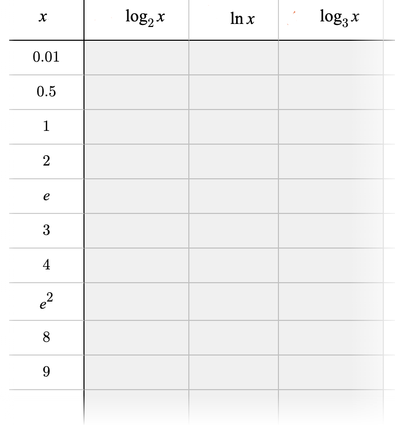
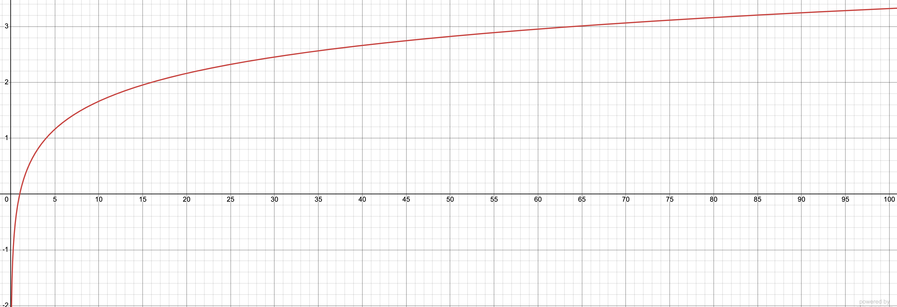
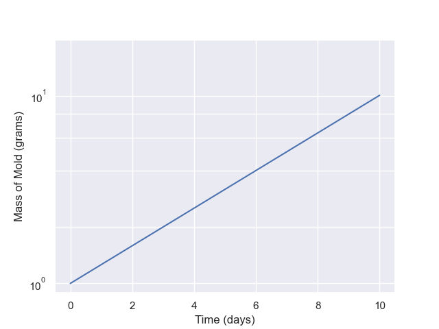
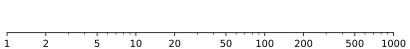

## 1 Return of the Mold Function

Recall from your previous assignment we had a doubling function for mold, $M=10(2)^t$ where $M$ is mold in grams and $t$ is time in days. Rewrite this as a base-2 logarithmic function where $M$ is the input variable and $t$ is the output variable.

## 2 Mold Log Graph

- Graph your logarithmic function from #1 so that we can estimate at what day the mold reaches 200 grams. Mold should be represented in the horizontal axis.
- What is your estimate for $t$ from the graph?
- Confirm your estimate is reasonable by plugging in your estmimate for $t$ produces 200 in your exponential function $M=10(2)^t$ in #1.
  

## 3 Comparing Different Log Relationships in a Table Using a Calculator
- Create an input-output tables ($x-y$ tables) for the three functions $y=\log_2x$, $y=\ln x$, and $y=\log_3x$ using the $x$-values shown in the table below.
  

To compute logarithms with bases other than the common log (base-10) and the natural log ($\ln$ aka base-e), we can use the change of base formula. $log_bM=\frac{log M}{\log b}$. For more information about this formula, check out this [Change-of-Base formula video](https://www.youtube.com/watch?v=28SlL5wVoXA)

## 4 Comparing Different Log Relationships on the Same Axes
- On the same set of axes, neatly graph $y=\log_2x$, $y=\log_3x$, and $y=\ln x$ using the table you created in #3. Make sure all points implied in the table are shown.

## 5 Mystery Base
Below is the graph of logarithmic function. Detemine the base of this function using 4 distinct points on the graph to justify your answer.

## 6 Estimates (Log Scale)

We have the following graph where the vertical axis is given in a logarithmic scale. When does the mass equal 7 grams? Explain your reasoning.

## 7 Create a Semi-log Plot

Create a semi-log plot for $y=e^x$ according to the instructions below.

- Measure the length between 1 and $e$ on the logarithmic scale (The $y$-axis).   
- Mark out a linear scale on the $x$-axis where each tick mark equals the length between 1 and $e$ on the $y$-axis. 
- Make a table of $x$ and $y$ values for $x=-1,0,1,2,3,4$ according to your scales. Report all values involving $e$ as exact values (no decimal approximations), e.g. $e^2$ is the exact value for $x=2$.  
- Plot the 6 points suggested by your table on your graph.

## 8 Create Spreadsheet Graph

In this exercise you’ll use a spreadsheet or similar technology (like Desmos) to graph an exponential function in two ways. 

- Make a table of data with $x$ and $y$ values that show an exponential function $y=b^x$ of your choice. The $y$-values should be generated by formula, not manually entered.
- Create a graph with a linear $y$-scale (a conventional exponential graph). 
- Create a graph with a logarithmic $y$-scale (a semi-log plot). You will need a second formula that converts your $x$-value to the appropriate $y$-value. Review our class notes from Wednesday, if needed.

## 9 Logarithmic Scale Roots

Using the logarithmic scale below, find the square root of 100, 1000, and the cube root of 100 and 1000.

Show how you are arriving at your estimates on the scale below.

## 10 Exponential Graph from Scales

- Using the semi-log plot from #7 for $y=e^x$
- Choose any two points $(x_1,y_1)$ and $(x_2,y_2)$ on your line. Then calculate the slope of the line on your graph according to $m=\frac{\ln(y_2)-\ln(y_1)}{x_2-x_1}$. 

## 11 Semi-log plot for $y=e^{2x}$

- Create a semi-log plot a similar procedure used in #7 for $y=e^{2x}$
- Choose any two points $(x_1,y_1)$ and $(x_2,y_2)$ your line. Then calculate the slope of the line on your graph according to $m=\frac{\ln(y_2)-\ln(y_1)}{x_2-x_1}$.
- Make a conjecture (a guess) for how we can determine the slope of a line on a semi-log graph from the equation in the form $y=e^{kx}$.

## 12 Semi-log plot for $y=8^x$

- Create a semi-log plot using a similar procedure used in #7 for $y=8^x$
- Choose any two points $(x_1,y_1)$ and $(x_2,y_2)$ your line. Then calculate the *exact value* (not a decimal approximation) of the slope of the line on your graph according to $m=\frac{\ln(y_2)-\ln(y_1)}{x_2-x_1}$. Hint: To find exact value of your slope, use the subtraction property of logarithms: $\ln(A)-\ln(B)=\ln\frac{A}{B}$  
- Make a conjecture (a guess) for how we can determine the slope of a line on a semi-log graph from the equation in the form $y=b^{x}$. 

