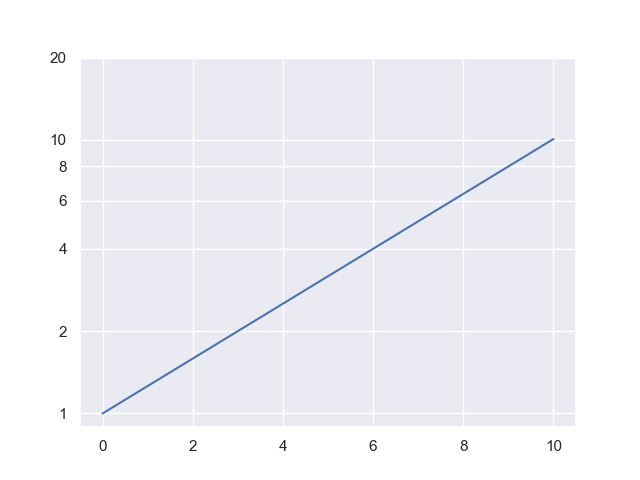

## 1 Return of the Mold Function

Recall from your previous assignment we had a doubling function for mold, $M=10(2)^t$ where $M$ is mold in grams and $t$ is time in days. Rewrite this as a logarithmic function where $M$ is the input variable and $t$ is the output variable.

## 2 Mold Log Graph

- Graph your function from #1 so that we can estimate at what day the mold reaches 200 grams. Mold should be represented in the horizontal axis.
- What is your estimate from the graph?
- Confirm your estimate is reasonable by pluggin in your estmimate for $t$ produces 200 in your exponential function $M=10(2)^t$ in #1.
  
## 4 Estimates (Linear Scale)

You have the following graph. At what time will we reach 27 grams of mold?

## 11 Doubling Time (Log Scale)

Please find and report the doubling time for this graph. How is it different from a linear-scale graph?

## 12 Forward or Inverse to Find Amount

Recall the graph for **7 Doubling Time Extrapolation**:

- Estimate the time at which the mass of mold is 15 grams and 30 grams.  
- If you were to do this analytically (using formulas) do you need an inverse (log) function or the exponential function to find the amount?  

## 5 Estimates (Log Scale)

You have the following graph. When does the mass equal 7 grams?

## 6 Inverse base $e$

We have the expression for mold growth of

$$
\text{mass} = A \cdot e^{b t}
$$

where $A = 2$ grams and $b = 0.08/\text{hours}$.

How long until I have 20 grams of mold?

## 7 Inverse base 10

$$
\text{mass} = A \cdot 10^{b \cdot t}
$$

where $A = 2$ grams and $b = 0.1/\text{hours}$.

How long until I have 50 grams of mold?

## 8 Draw Your Own Log Scale

On a piece of paper

- create four evenly spaced marks  
- for each of these marks, write 1, 10, 100, 1000  
- halfway between each of those marks, write another mark  

What number goes on each of these new marks?

## 9 Create Spreadsheet Graph

In this exercise you’ll use a spreadsheet to graph an exponential function

- Make a table of data with $x$ and $y$ values  
- Create a chart with a linear $y$-scale  
- Create a chart with a log $y$-scale  

## 10 Logarithmic Scale Roots

Using a logarithmic scale, find the square root of 100, 1000, and the cube root of 100 and 1000.

Show the distances on a scale.

## 11 Determine if Exponential or Not

Using the provided spreadsheet file, use a spreadsheet to determine if the data is exponential or not.

Describe the test you used for the data.

**Challenge:** Determine the formula for the non-exponential data

# 12 Estimate Logarithm with Distance

Show how to estimate the logarithm of a number between 20 and 90 using a logarithmic scale on paper and a length measurement.

- Choose your own number  
- Show the base 10 logarithm  
- Show the natural logarithm  
- Show explicitly how the measured lengths in mm can be converted to the logarithm  

# 13 Draw Linear and Log Scales

This uses the log and linear scale handout.

- Which scale is linear, a or b?  
- Which scale is logarithmic, a or b?  
- Use a ruler and mark the locations of 2.5, 4, 7, 10, and 15 on the linear scale.  
- Use a ruler and mark the locations of 4, 8, 10, 16, 20, 25, 40, 80, 100, 125, and $\sqrt{8}$  

# 14 Exponential Graph from Scales

Use a logarithmic scale for this exercise.

- Measure the length between 1 and $e$ on the logarithmic scale  
- Mark out a linear scale where 1 data equals this length  
- Label the logarithmic scale as $y$ and the linear scale as $x$  
- Make a table of $x$ and $y$ values according to your scales  
- Plot this out  

For practice do this again for other values besides $e$.

# 15 Exponents and Logarithms from Scales

Use a logarithmic scale for this exercise.

- Measure the length between 1 and $e$ on the logarithmic scale  
- Mark out a linear scale where 1 data equals this length  
- Label the logarithmic scale as $y$ and the linear scale as $x$  
- Make a table of $x$ and $y$ values according to your scales  
- Show that these $x$ and $y$ values give excellent estimates for $e^x$ and $\ln y$ on a calculator  

For practice do this again for other values besides $e$.
