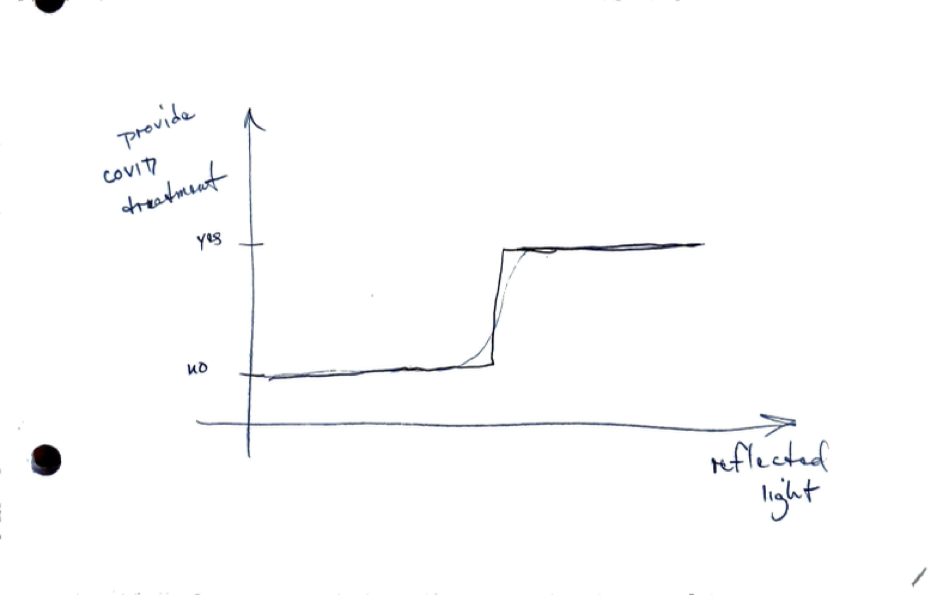

# Models

A model is a mathematical representation of the world. Models are most often used to make predictions about the world. These predictions can guide our decisions and make better outcomes more probable.

We will learn how to create simple models that enable us to gain insight into the problem we are investigating.

Why do we model? If we have a cause-and-effect relationship, a model can help us determine how much of the cause we should apply to achieve the desired effect.

Mathematical models consist of equations that reflect relationships in the real world.

Mental models may or may not involve mathematics.

# Review

How are models distinct from estimations and relationships?

- Estimations are an educated guess about the state of reality.
- Relationships are a feature of a natural system that we can observe.

Models are artificially constructed using estimations and relationships to gain insight and to improve decision making.

# Estimations and Models

The estimations we created in the previous section were based on simple models.

To predict the catering order precisely, we’d need to know the schedules, appetite, and dietary preferences of every Sonoma State community member—an impractical problem.

Our models contained vast simplifications, but are still likely to provide decent predictions.

There is a statistical saying, “All models are wrong, some are useful,” that captures this idea.

# Models

Here are a few ideas about models:

- A model is a simplified representation of a problem we’d like to solve
- A model is an approximation that allows us to think about the world
- Models:
  - rectangle for the area of a plot of land
  - linear functions
  - exponential function for population growth
  - a roll of a die or several dice for random events
  - a bathtub with a faucet and a drain for atmospheric carbon
  - equations from physics classes
  - a set of equations to predict motor behavior

# Types of Models

# Soap Dispenser

There is a relationship between the distance of a hand from the faucet and the infrared light reflected.

*Reflected infrared light from a hand.*

This reflected light is used to create a mathematical model of whether the hand is present.

*Model for soap dispensing based on reflected light.*

# Pulse Oximeter and COVID Treatment

The amount of light reflected back decreases with the amount of oxygen in the blood.

*Light absorption and reflection in hemoglobin.*

This reflected light is used to create a model for when COVID treatment should be administered.

*Decision model for COVID treatment.*

Studies have been published (see references) that show this model leads to undertreatment of people with darker skin.

# Equation Models

These are mathematical functions where each value on the x-axis has one corresponding value on the y-axis.

For a straight line, we have:

$y = m \cdot x + b$

For an exponential, we have:

$y = a \cdot e^{bx}$

# Random Variable Models

Many observable things in the world take on different values as if at random. We can model these with a mathematical object called a random variable.

The random variable for a Gaussian distribution is written as $\mathcal{N}$.

The binomial distribution (useful for discrete values) is written as $B$.

# Linear Regression Model

This relationship has a continuous independent variable with a continuous dependent variable.

The model for this relationship is a combination of a line and a random variable:

$$
y = m\cdot x + b + \mathcal{N}
$$

# Binary – Continuous

This relationship has a binary independent variable and a continuous dependent variable.

We could write a model as:

$$
y = \mathcal{N}(\text{mean} + \text{shift} \cdot x)
$$

Meaning that if $x = 0$ the mean of the random variable is at one value, and if $x = 1$, the mean changes.

# Binary – Binary

This relationship has a binary independent variable and a binary dependent variable.

We could write a model as:

$$
y = B(\text{probability} + \text{shift} \cdot x)
$$

This model tells us that if $x = 0$, there is one probability, and if $x = 1$, the probability changes.

# Logistic Regression Model

This relationship has a continuous independent variable and a binary dependent variable.

We could write a model where the probability in our binary random variable changes as the value of $x$ changes.

# Usefulness

These models give us a way to conduct thought experiments and understand how a system might respond.

# Types of Models

- **Top-down (empirical) models**
  - Use collected data to infer a relationship between two quantities
- **Bottom-up (mechanistic) models**
  - Use a detailed model of underlying behavior to deduce a relationship between two quantities

# Downsides of Models

Some models can be used to harm people or communities. These harms are often unintentional, but still significant.

- Opacity
- Scale
- Damage

# Examples of Models

- [Soto Latent Heat Activity](https://pubs.aip.org/aapt/pte/article-abstract/62/4/284/3279693/Addressing-a-Sensible-and-Latent-Heat?redirectedFrom=fulltext)
- [Laney and Moses Wildlife Practices](https://www.tandfonline.com/doi/full/10.1080/10871209.2020.1825877)
- [General Circulation Model](https://www.ipcc-data.org/guidelines/pages/gcm_guide.html)
- [Predator–Prey Model](https://en.wikipedia.org/wiki/Lotka%E2%80%93Volterra_equations)
- [Odum Silver Springs Ecosystem Model](https://en.wikipedia.org/wiki/Ecosystem_model#/media/File:Silver_Spring_Model.jpg)
- [Camera Trap Population Models](https://besjournals.onlinelibrary.wiley.com/doi/full/10.1111/1365-2664.13913)
- [PM2.5 Relative Risk and Excess Mortality](https://www.sciencedirect.com/science/article/pii/S2590332224004871)
- Toxin Exposure–Risk Models
- Occupancy Sensor Models
- Climate Change Temperature Models
- Climate Change Economic Models

# Journal Article

Pick a topic of interest and search the scientific literature for models related to your topic. Read the abstract and paper to find a description of a model. Post a brief description of your topic and model in the cloud worksheet and include a link to the paper.

# References

- [Gavin Schmidt: Skillful Climate Models](https://www.youtube.com/watch?v=JrJJxn-gCdo)
- [Pulse Oximetry – New York Times](https://www.nytimes.com/2022/11/02/health/pulse-oximeters-black-patients.html)
- [Pulse Oximetry Bias and COVID-19](https://jamanetwork.com/journals/jamainternalmedicine/fullarticle/2792653)
- [Pulse Oximetry Evidence and Implications](https://pubmed.ncbi.nlm.nih.gov/36166259/)
- [Soap Dispenser Example](https://www.facebook.com/chukwuemeka.afigbo/posts/1666843806667985/)
