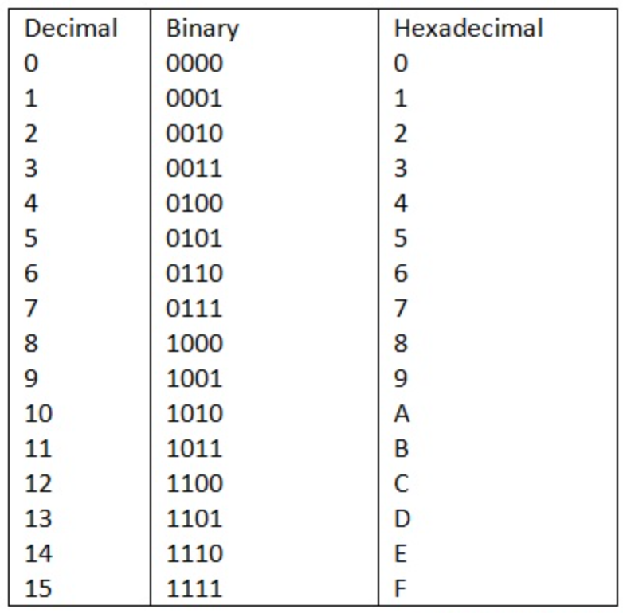

<h1 id="place-value">Place Value</h1>

This section explores our number system and how it works. We rarely think about our number system explicity. It can seem that our numbers just simply exist as part of the world. This is far from the case. Historically, the type of number system that we use, a so-called <it>positional number system</it> is unusual, and was developed relatively recently when compared to many other number systems. 

<h1 id="Tally-type">Tally-type (Unary) Number Systems</h1>

Many early number systems are slightly upgraded tallying systems, where the value of the number is a result of adding up the values of the symbols. 

<ul>
<li>Roman numerals</li>
<li>Egyptian numerals</li>
<h2 id="roman-numerals">Roman Numerals</h2>

<h2 id="egyptian-numerals">Egyptian Numerals</h2>

</ul>
<h1 id="Hybrid Tally and Positional Systems">Hybrid Tally and Positional Number Systems</h1>
<h2 id="babylonian-numerals">Babylonian Numerals</h2>
Babylonian Numerals used a tally-type system up to 60, and then used a base positional system to indicate powers of 60. However, they did not use the symbol 0.

<h2 id="mayan">Mayan Numerals</h2>
Mayan Numerals used a tally-type system up to 20, and then used a base positional system to indicate powers of 20. The Mayans did have a symbol for zero (a shell) as a place holder. 

<h2 id="the-invention-of-the-zero">The Invention of Zero</h2>

The invention of the zero was a significant advance in our number systems. Among other things, zero acts as a crucial placeholder, allowing for the easy representation of large numbers and efficient, systematic computation (e.g., 11 vs. 101).

<h1 id="modern-numbers">Modern Numbers</h1>
<h2 id="base-10-place-value-systems">Base 10 Place Value Systems</h2>

The value of a digit depends on its position relative to our decimal point. Notice that although we don’t always write the decimal point, its position is always important.

Another question for you to think about is, <em>why do you “carry the one” when you add and multiply</em>?

<figure>
<figcaption aria-hidden="true">Morpheus knows why you carry the one.</figcaption>
</figure>
<h1 id="early-number-systems">Early number systems</h1>
<h2 id="different-bases">Different bases</h2>
<ul>
<li>We can use any non zero number as the basis of a place-value system</li>
<li>Computers use base 2 and 16</li>
<li>These bases provide different representations of the same number</li>
</ul>
<h2 id="the-number-5">The number 5</h2>
<ul>
<li>Here are five dots …..</li>
<li>We can call this “five”</li>
<li>Others call it “cinco”</li>
<li>In decimal we would write “5”</li>
<li>In binary we would write “101”</li>
</ul>
<h2 id="base-10-rules">Base 10 Rules</h2>
<ol type="1">
<li>The place to the left of the decimal is worth 1 (the ones place)</li>
<li>Every place value represents 10 times the place on its right</li>
<li>There are ten distinct symbols (0 through 9) that can be used to represent any base-10 representable numbers.
<ul>
<li>(Remember, 10 is not a symbol, it is a combination of 1 and 0.)</li>
</ul></li>
<li>When counting in base 10, if we exceed the available values (0-9) for a paricular place value, we add a 1 to the place value immediately to th left.</li>
</ol>
<h2 id="base-x-rules">Base X Rules</h2>
<ol type="1">
<li>Place to the left of the decimal is worth 1 (true for any base) </li>
<li>Every place value represents X times the place on its right</li>
<li>There are only X distinct symbols (0 through X-1) that can be used to represent any base-X representable numbers.
<ul>
<li>(Remember, X is not a symbol, it is a combination of 1 and 0. First rule of base X, don’t talk about X.)</li>
</ul></li>
<li>If we exceed the available values in a place, we go to the left</li>
</ol>
<h2 id="counting">Counting</h2>
<table>
<thead>
<tr class="header">
<th style="text-align: left;">Base 10</th>
<th style="text-align: left;">Base 8</th>
<th style="text-align: left;">Base 5</th>
<th style="text-align: left;">Dots</th>
</tr>
</thead>
<tbody>
<tr class="odd">
<td style="text-align: left;">1</td>
<td style="text-align: left;">1</td>
<td style="text-align: left;">1</td>
<td style="text-align: left;">.</td>
</tr>
<tr class="even">
<td style="text-align: left;">2</td>
<td style="text-align: left;">2</td>
<td style="text-align: left;">2</td>
<td style="text-align: left;">:</td>
</tr>
<tr class="odd">
<td style="text-align: left;">3</td>
<td style="text-align: left;">3</td>
<td style="text-align: left;">3</td>
<td style="text-align: left;">:.</td>
</tr>
<tr class="even">
<td style="text-align: left;">4</td>
<td style="text-align: left;">4</td>
<td style="text-align: left;">4</td>
<td style="text-align: left;">::</td>
</tr>
<tr class="odd">
<td style="text-align: left;">5</td>
<td style="text-align: left;">5</td>
<td style="text-align: left;">10</td>
<td style="text-align: left;">::.</td>
</tr>
<tr class="even">
<td style="text-align: left;">6</td>
<td style="text-align: left;">6</td>
<td style="text-align: left;">11</td>
<td style="text-align: left;">:::</td>
</tr>
<tr class="odd">
<td style="text-align: left;">7</td>
<td style="text-align: left;">7</td>
<td style="text-align: left;">12</td>
<td style="text-align: left;">:::.</td>
</tr>
<tr class="even">
<td style="text-align: left;">8</td>
<td style="text-align: left;">10</td>
<td style="text-align: left;">13</td>
<td style="text-align: left;">::::</td>
</tr>
<tr class="odd">
<td style="text-align: left;">9</td>
<td style="text-align: left;">11</td>
<td style="text-align: left;">14</td>
<td style="text-align: left;">::::.</td>
</tr>
<tr class="even">
<td style="text-align: left;">10</td>
<td style="text-align: left;">12</td>
<td style="text-align: left;">20</td>
<td style="text-align: left;">:::::</td>
</tr>
</tbody>
</table>
<h2 id="Base Notation">Base Notation</h2>

Since we do dot often work outside our base-10 system, we don't need to indicate the base we are working in. If we need to indicate our number is in an alternative base, we indicate the base as a subscript.  For example,

<li> $13_{5}=8_{10}$ </li>
<li> $102_{3}=23_{4}$ </li>
<li> $8_{9}=10_{8}$ </li>
Concept check: Confirm each of the examples above are true.
<h2 id="our-base-10-system">Our Base 10 System</h2>

<h2 id="what-if-you-only-have-eight-fingers">What if you only have eight fingers?</h2>

<h2 id="base-8">Base 8</h2>
<ul>
<li> $8^0 = 1$ </li>
<li>$8^1 = 8$</li>
<li>$8^2 = 64$</li>
</ul>
<h2 id="binary-representation">Binary representation</h2>

A base 2 system is the basis for computer representations of numbers.

The computer performs all calculations in binary and then converts to decimal.

<h2 id="hexadecimal-representation">Hexadecimal representation</h2>

This is a base sixteen representation. It includes the letters A, B, C, D, E, and F to represent 10, 11, 12, 13, 14, and 15.

You may see this if you have worked with computer colors for websites or graphic design.

<h2 id="Conversion Table for Decimal, Binary, and Hexidecimal">Conversion Table for Decimal, Binary, and Hexidecimal</h2>
<figure>

</figure>
