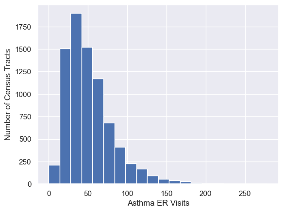

<h1 id="central-limit-theorem">Central Limit Theorem</h1>

The distribution of means of samples of any population with any
distribution will be normally distributed and have a standard deviation,
called a standard error, that is

Implications:

<ul>
<li>the means of large random samples of any population (with any
distribution) will have a normal distribution around the population
mean</li>
<li>the standard error (a function of the population standard deviation
and the sample size) tells us how close these sample means lie to the
population means</li>
<li>sample means further from the population mean are less likely</li>
<li>the less likely our samples means are, the more we should suspect
another causal effect</li>
</ul>
<h1 id="central-limit-theorem-inferences">Central Limit Theorem
Inferences</h1>
<ul>
<li>with population information (mean, std dev) you can make inferences
about properly-drawn samples</li>
<li>with information about a properly drawn sample, you can make
inferences about the population</li>
<li>if you have data on a sample and the population, you can tell if the
sample is consistent with likely samples from the population</li>
<li>if you have data on two samples, you can see if they were likely
drawn from the same population</li>
</ul>
<h1 id="definitions">Definitions</h1>
<h2 id="population-distribution">Population Distribution</h2>

The distribution of a measurement for an entire population.

<h2 id="sample-distribution">Sample Distribution</h2>

The distribution that results from taking a statistic from repeated
samples of a population.

This is often the means of a sample from the population.

The central limit theorem tells us that if we take repeated samples
of a population, the sample distribution will have the same mean, but
the standard deviation of the sample distribution is equal to the
standard deviation of the population divided by the square root of the
number of samples.

<h2 id="likelihood">Likelihood</h2>

A key question is given an expected distribution, how likely is it
that I’m seeing my (or a more extreme) observation?

Example: If I draw a human on earth at random, how likely is it that
they are 2 meters or taller?

<h2 id="hypothesis-testing">Hypothesis Testing</h2>

The practice of determining whether an observed difference is due to
random fluctuations or the experiment (drug, education, etc).

<h2 id="statistical-significance">Statistical Significance</h2>

A measure of the probability that the mean of a random sample from a
subpopulation was randomly drawn from the larger population.

For example, if you drew 10 random SSU students and they were all
taller than 6 feet, this probably wasn’t random but was at basketball
team practice.

<h2 id="effect-size">Effect Size</h2>

This is the difference in the mean between an original distribution
and the distribution after a treatment or from looking at a
subpopulation.

<h2 id="null-hypothesis">Null Hypothesis</h2>

Some examples

<ul>
<li>Experimental drug outcome is not better than placebo</li>
<li>Participation in a program does not increase outcomes</li>
</ul>
<h1 id="a-basic-recipe">A basic recipe</h1>
<ul>
<li>identify your measurement</li>
<li>determine how you’ll create your sample</li>
<li>identify your null hypothesis</li>
<li>determine the mean and standard deviation of your population</li>
<li>find the average of your sample</li>
<li>find the standard error
<ul>
<li>the standard error is the standard deviation for the normal
distribution describing a large number of random draws the same size as
your sample</li>
</ul></li>
<li>compare the difference in averages to your standard error</li>
<li>decide if the null hypothesis is likely or unlikely based on this
comparison</li>
</ul>
<h1 id="normal-distribution">Normal Distribution</h1>

To quantify the likelihood of our averages, we use the normal or
gaussian distribution as a tool.

Here is an ideal normal distribution.  

It has the equation

Where $\mu$ is the mean, and $\sigma$ is the standard deviation.

If we know our distribution is normal and we know the mean $\mu$, and the standard deviation 
$\sigma$, we know the probability of finding
value near the mean.

<ul>
<li>68% of values fall within one standard deviation of the mean</li>
<li>95% of values fall within two standard deviations of the mean</li>
<li>99.7% of values fall within three standard deviations of the mean</li>
</ul>
<h2 id="standard-error">Standard Error</h2>

No matter the original population, the averages of samples will
create a normal distribution with the same mean $\mu$.

The standard deviation of this distribution has a special name, the
standard error, or SE.

If you repeatedly take sample means, the standard error is the amount
of variablity we expect these sample means to have. This amount variability goes down as
you include more data in each of the repeated samples.

The standard error is related to the standard deviation of the
population by the following equation, where

<ul>
<li>The  $SE$  is the standard error of the
sample</li>
<li>  $\sigma$  is the standard deviation of
the population</li>
<li>  $n$  is the size of the sample selected from the population.</li>
</ul>

 $$SE=\frac{\sigma}{\sqrt{n}}$$ 

We can use the same 68-95-99 reasoning for how likely it is that our
difference in the means is likely or unlikely.

<h1 id="distribution-of-averages-of-random-samples">Distribution of
Averages of Random Samples</h1>

<video
src="./figures_static/statistics/ShowRandomVariateAverages.mp4"
style="width:100.0%" controls=""><a
href="./figures_static/statistics/ShowRandomVariateAverages.mp4">Video</a></video>

The central limit theorem tells us about the width of the
distribution of averages taken from a larger population.

Here we take the overall statistics for asthma in California from the
CES data.

For this data, the mean is 52.0 and the standard deviation is
30.6.

If we take repeated samples of 10, 100, or 1000 census tracts and
plot those in a histogram, we notice that the width of the distribution
of the averages decreases as the number of census tracts included in the
average goes up.

For these averages, the mean is 52.1 and the standard deviation is
9.4.

According to the central limit theorem, using  $n=10$ , the standard error will be
be

 $$SE=\frac{\sigma}{\sqrt{n}}=\frac{30.6}{\sqrt{10}}\approx 9.68$$ 

so the prediction is very close.

Here the observed mean is 52.0 and the standard deviation is 3.06,
which matches the expected deviation very well.

<
 $$SE=\frac{\sigma}{\sqrt{n}}=\frac{30.6}{\sqrt{100}}=3.06$$ 

Here the expected standard deviation is:

 $$SE=\frac{\sigma}{\sqrt{n}}=\frac{30.6}{\sqrt{1000}}\approx 0.968$$ 

This matches the observed devation of 0.910 very well and the mean is
52.0 also matching well.

If we have an asthma intervention (air filtering in schools, better
health screening, etc.) and we apply it to a number of census tracts, we
would compare the average asthma incidence in the treatment areas to one
of these distributions with the same number of samples.

Implications

<ul>
<li>More samples make seeing the same difference in the means less
likely</li>
<li>In order to say that a difference in means is unlikely, our average
needs to be large enough so that the distribution of sample means is
narrow</li>
</ul>
<h2 id="standard-error-1">Standard Error</h2>

This animation shows that as the number of samples grows, the width
of the sample distribution shrinks, making smaller differences of means
more likely.

<video src="./figures_static/statistics/StandardError.mp4"
style="width:100.0%" controls=""><a
href="./figures_static/statistics/StandardError.mp4">Video</a></video>

<h1 id="example">Example</h1>

Let’s say we want to try an intervention where we install
high-quality air filters in all the schools in some of the census tracts
(say 200 census tracts).

We would take the average of the asthma incidents in these census
tracts and compare to the distribution of 200 random census tracts drawn
repeatedly.

<!-- ## Statistical Inference

The use of a sample to determine the characteristics of the larger population. -->
<!-- ## Sample Mean

This is the mean of a sample of data we take from a larger population.

We are often concerned with how well this sample mean predicts the mean of the overall population. -->
<!-- ## Central Limit Theorem

- The distribution of means of large randomly-drawn subpopulations forms a gaussian distribution
- The width of this distribution of sample means is narrower for larger subpopulations -->
<!-- ## Inference

Assigns a probability of observing the null hypothesis or alternative hypothesis. -->
<!--

## Populations Example

- If you have an adult human over 180cm tall, are they more likely to identify as male or female?
- If you have an adult human under 150cm tall, are they more likely to identify as male or female?

# Spreadsheets

Common functions

- Mean or average `=average(range)`
- Gives the percentage of values below `value` in the range of data `=percentrank(range, value)`
- Gives the value at which `percentile` of the data is below that value `=percentile(range, percentile)`
- Median `median(range)`
- Standard Deviation `stdev(range)`
- Range of data `A1:A10`
- Range of data (entire column) `A:A`
- Range of data from another sheet `SheetName!A:A`
- ={data!A:A} gets an entire column from other sheet/tab from a command in one cell

:::{.instructor}

Need to add range syntax and link to other resources above

Querying a range of cells:

{width=75%}

TODO: consider deleting or improving, not obvious what this is

:::

We can select a subpopulation from a column of spreadsheet data in Google Sheets using the query language.

`=query(data!A:BT, "select A where B < 10")`

- `=query` is the command
- `data!` tells the computer to look at the data sheet
    - if your sheet name has spaces in it, you'll need to put the sheet name in single quotes ('')
- `A:BT` says use columns A through BT
- `select A` says take values from column A
- `where B < 10` says to take those values from where column B is less than 10
- use `"&D1$"` in the query if you want to use cell value D1 in the condition in your query

{width=75%}
-->
