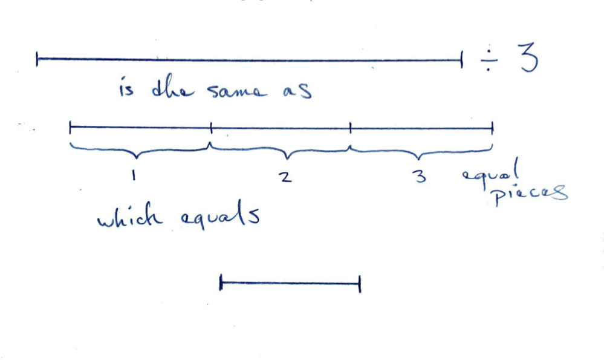
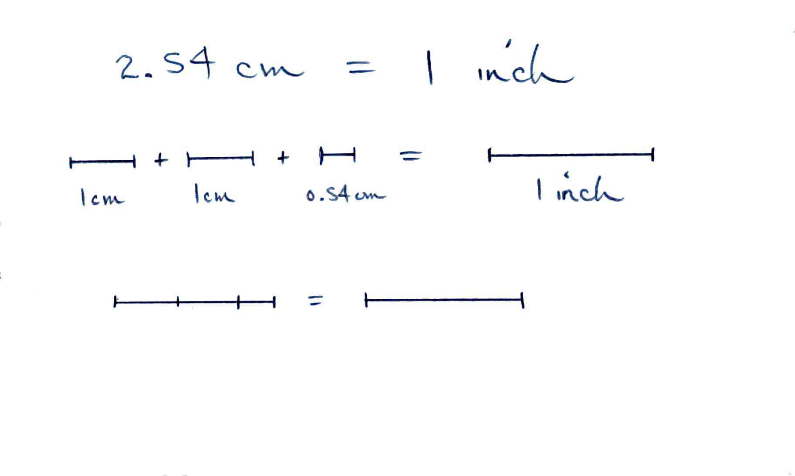

# Unit Conversion 

## Mathematical Properties of Units

### Adding and Subtracting

6 meters plus 170 pounds has no meaning since these are different dimensions.

You can add 5 feet and 3 meters if you convert to same unit first.

This concept in algebra is akin to 'combining like terms'.

### Multiplying and Dividing

5 feet multiplied by 10 pounds could have meaning even though these are different dimensions.
(In this case if we have a 5 feet lever with 10 pounds of force at the end, that is 50 foot-pounds of torque.)

## Multiplying with Quantities

- Multiplying a length by a number gives a length
    - 1 meter times 10 equals 10 meters
    - 1 stride times 10 strides equals 10 strides
- Multiplying a length by a length gives an area
    - 1 foot times 1 foot equals 1 square foot

$$ 2 \cdot 2 = 2^2 $$
$$ a \cdot a = a^2 $$

$$ 
\textrm{inch} \cdot \textrm{inch} = \textrm{inch}^2 
$$ 

## Dividing with Quantities

$$\frac{2\cdot 4}{4 \cdot 5} = \frac{2}{5} $$
$$\frac{a\cdot b}{b \cdot c} = \frac{a}{c} $$
$$\frac{\textrm{meter}\cdot \textrm{foot}}{\textrm{foot} \cdot \textrm{pound}} = \frac{\textrm{meter}}{\textrm{pound}} $$

## Length by Number

When we divide a length by a number we use partition.

Quotition is meaningless since length and number are different dimensions.

## Length by Length

When we divide a length by a length we use quotition, subtracting the length repeatedly.

<!-- TODO: good sentence for why no partition -->

 

## Two units in the denominator
- Births per capita per year
- Hours per week per unit

## Proportional Reasoning

- You have a mass $m$ of water and you see that when you add $E$ joules of energy the temperature raises by $T$ degrees. How much do you expect the water to raise if you add twice as much energy? Can you write this as a unit conversion?
- You have a population of $P$ people and they give birth to $B$ babies over the course of a year. How many people do you expect them to give birth to over two years? How many births in a year do you expect if you have 2 million people?
- It is widely assumed that students will spend 3 hours each week for every unit of credit they are taking in college. How many hours a week do you need to spend for a two unit class? How many hours do you need to spend over two weeks for a one-unit class?

## Combinations of units

- We often combine units to express new quantities

<!-- can you think of a derived unit? -->

## Student density
- Students per acre
- Number per area
- Spans two orders of magnitude

## Example: Units of students per acre

[Cal State densities](https://twitter.com/calpolypomona/status/431937140457349120/photo/1)

The main objective we are practicing in this section, is to write out our unit conversions using a mathematical notation. 

Our unit conversions on paper should:

- Clearly show the number arithmetic leading to the answer
- Clearly show the unit arithmetic leading to the answer
- All equals signs must have equal quantities on both sides of the equals sign
- Follow accepted mathematical conventions

# Opening Question

- Can we divide a length by a number? What do we get?
- Can we divide a length by a different length? What do we get?

## Unit conversion factors

- These factors are equivalent to one
- They can have units but be dimensionless
- They are not numerically equal to one in most cases.
- Units can be crossed out

## Different Dimensions

- You cannot convert a quantity with one dimension to another dimension with a unit conversion factor
- There may be a linear relationship between those two quantities that looks like a "conversion" but isn't
- For example stoichiometry uses fractions that look like conversion factors, but the dimensions are often changing

# Creating a Conversion Factor

Start with a quantity equality

Now use algebra rules to create a fraction equal to one

$$ {{2.54 cm}\over{1 inch}} = {{1 inch}\over{1 inch}} $$

$$ {{2.54 cm}\over{1 inch}} = 1 $$

We can also divide both sides by 2.54 cm instead.

$$ {{1 inch}\over{2.54 cm}} = {{2.54 cm}\over{2.54 cm}} $$

$$ {{1 inch}\over{2.54 cm}} = 1 $$

Multiplying a length by these factors doesn't change the length since the factor is equal to one.

We can also thing of multiplying this factor as dividing by a length to get a number and then multiplying by an equal length with different units.

<!-- 

 -->

<!-- ## Unit conversion factors

These two quantities are equal.

$$ 3\;\textrm{feet} = 1\;\textrm{yard} $$

If we divide both sides by 3 feet, we get

$$ 1 = \frac{1\;\textrm{yard}}{3\;\textrm{feet}}  $$

Note that this quantity has units of yard per feet, but has no
dimensions since it is a length divided by a length.  If you multiply a
quantity of feet by this, you won't change the quantity but you will
change the units. -->

# Alternative Method

To convert 10 meters to feet:

$$ 1 m = 3.28 ft $$
$$ 10 \cdot 1 m = 10 \cdot 3.28\; ft $$
$$ 10 m = 32.8 ft $$

To convert 30 miles per hour to meters per second:

$$ 1\; mile = 1609\; meters $$
$$ 1\; hour = 3600\; seconds $$

We can divide these two equations to get a combined unit conversion equality or equation.

$$ 1\; mile \div 1\; hour = 1609\; meters \div 3600\; seconds $$
$$ 1\; \textrm{mile per hour} = 0.447\; \textrm{meters per second} $$

Now we can use this for conversions.

$$ 30 \cdot 1\; \textrm{mile per hour} = 30 \cdot 0.447\; \textrm{meters per second} $$
$$ 30\; \textrm{miles per hour} = 13.4\; \textrm{meters per second} $$

# Using Conversion Factors

The strategy we will use is to write the quantity with the units you are starting with on the left side of our paper and the units we want to get to on the right side of your page. Then we can fill in the unit conversions necessary to get to your desired units.

Some folks prefer to do this in steps with each conversion on a single line.
Other prefer to do it straight across the page as in the examples below.

At the end ask if your quantity makes sense.
Often the resulting number will be smaller or larger (though the quantity is the same).

# Mass Example

Convert the quantity of 150 pounds to kilograms.

$$ 150\;{\color{blue}\cancel{\textrm{pounds}}}
   \cdot
   \frac{1\;\textrm{kilogram}}
        {2.2\;\color{blue}\cancel{\textrm{pound}}}
   = 68\;\textrm{kilograms} $$

# Speed Example

Convert the quantity of 100 miles per hour to meters per second.
Note that we make two unit conversions.
One from miles to meters and another from hours to seconds.

Once we have this set up, we perform the computation on a calculator or other device.

$$ \frac{100\;{\color{blue}\cancel{\textrm{miles}}}}
        {\color{green}\cancel{\textrm{hour}}}
   \cdot
   \frac{1600\;\textrm{meters}}
        {\color{blue}\cancel{\textrm{mile}}}
   \cdot
   \frac{\color{green}\cancel{\textrm{hour}}}
        {60\;\color{purple}\cancel{\textrm{min}}}
   \cdot
   \frac{\color{purple}\cancel{\textrm{min}}}
        {60\;\textrm{sec}}
   = 44\;\frac{\textrm{meters}}
          {\textrm{sec}} $$

Some students prefer to perform this computation in steps.

$$ \frac{100\;{\color{blue}\cancel{\textrm{miles}}}}
        {\textrm{hour}}
   \cdot
   \frac{1600\;\textrm{meters}}
        {\color{blue}\cancel{\textrm{mile}}}
     = \frac{160,000\;\textrm{meters}}{\textrm{hour}}
$$
$$
   \frac{160,000\;\textrm{meters}}{\color{green}\cancel{\textrm{hour}}}
   \cdot
   \frac{\color{green}\cancel{\textrm{hour}}}
        {60\;\textrm{min}}
     = \frac{2667\;\textrm{meters}}{\textrm{min}}
$$
$$
  \frac{2667\;\textrm{meters}}{\color{purple}\cancel{\textrm{min}}}
   \cdot
   \frac{\color{purple}\cancel{\textrm{min}}}
        {60\;\textrm{sec}}
   = 44\;\frac{\textrm{meters}}
          {\textrm{sec}} $$
<!-- show example here -->

# "Per Per" Example

In August 2021, Sonoma County is recording 20 new cases per day per 100,000 people.
If we have a population of 5,000 people, how many cases per week do we expect?

$$ \frac{20\;\textrm{cases}}{{\color{green}\cancel{\textrm{day}}}\cdot 100,000\;\color{blue}\cancel{\textrm{people}}}
\cdot
   5,000\;{\color{blue}\cancel{\textrm{people}}}
\cdot
   \frac{7\;\color{green}\cancel{\textrm{day}}}{\textrm{week}}
= 7\;\textrm{cases per week}
$$

<!-- this example isn't great, can I come up with a true per/per unit conversion? besides the heat capacity one? -->

It is recommended that students spend in total 3 hours per week per unit.
Let's assume all of our classes are 4-units, we can then convert this to minutes per day per class.

$$
\frac{3\;\color{blue}\cancel{\textrm{hours}}}
        {\color{purple}\cancel{\textrm{week}}\cdot\color{green}\cancel{\textrm{unit}}}
\cdot
\frac{60\;\textrm{min}}
     {\color{blue}\cancel{\textrm{hour}}}
\cdot
\frac{4\;\color{green}\cancel{\textrm{units}}}
     {\textrm{class}}
\cdot
\frac{\color{purple}\cancel{\textrm{week}}}
     {7\;\textrm{days}}
= 103\;
\frac{\textrm{minutes}}
        {\textrm{day}\cdot\textrm{class}}
$$

## Two units in the denominator

This is often confusing.
A few thought experiments can help.

- Is eggs per chicken per day the same as eggs per day per chicken?

<!-- - Is energy per temperature per mass the same as energy per mass per temperature?
- Is J/g/C the same as J/C/g?
- Is 1/2/3 the same as 1/3/2?
- Is $\frac{J}{gC}$ the same as $\frac{J}{Cg}$ -->

## Multiple Units

In the example above, you may see the quantity written in several different ways:

- 3 hours per week per unit
- 3 hours/week/unit
- 3 hours/week $\cdot$ unit
     - this one has an implicit parenthesis around the week and unit

Another example is that humans need approximately 2000 kcalories per person per day.

## Food Example

Estimation: How many calories worth of food does the caf need to buy each week?

A unit could be calories per student per week.

<!-- 2200 kcal/person/day * 7 day/week * 2500 persons/caf = 38,500,000 kcal/caf/week -->

<!-- ## Converting Body Units

Let's say you measure that your stride is 5 feet and a distance is 6 strides.
You can then convert strides to feet and meters.

6 strides x 2.5 ft/stride = 15 feet

6 strides x 2.5 ft/stride x 1 meter/3.28 ft = 4.6 meters -->

<!-- ## Dimensional analysis example

We can use the dimensions of the relevant quantities to deduce the form
of an equation -->

<!--  -->

<!--  -->

<!-- what are some units and some unusual units -->
<!-- clicks, bytes, click velocity -->

<!-- Energy has dimensions of mass times length squared divided by time squared.

$$ E = \frac{\textrm{[mass]}\textrm{[length]}^2}{[\textrm{time}]^2} $$

If we know that the mass and velocity are related to energy, we can find how by:

- $m$ mass of the object
- $v$ velocity of the object

That is we think the energy formula must be of the form:

$$ E \propto m^a v^b $$

We can substitute these units

$$ m = [\textrm{mass}]$$
$$ v = \frac{\textrm{[length]}}{\textrm{[time]}} $$

Set equal to the units for energy

$$ \textrm{[mass]}^a \frac{\textrm{[length]}^b}{[\textrm{time}]^b} = \frac{\textrm{[mass]}\textrm{[length]}^2}{[\textrm{time}]^2} $$

and deduce that

$$ E \propto m v^2 $$

These units match the formula for kinetic energy and for mass-energy equivalence. -->

# Temperature

Temperature conversions are different depending on if we are converting differences or absolute temperatures.

We can see a similar issue with distances and positions. (The mathematical term for this is an affine space.)

We can add two distances together. If it is 8 miles to drive from Santa Rosa to Rohnert Park and 12 miles to drive from Rohnert Park to Petaluma, it is 20 miles to drive from Santa Rosa to Petaluma.

However, adding (the positions of) Santa Rosa and Petaluma doesn't mean anything.

Similarly, if it is 70 degrees Fahrenheit here and 80F somewhere else, adding those temperatures together doesn't mean anything.

## Related Videos

- [Drawing a Cube](https://www.youtube.com/watch?v=KQZzsm8Q7qo)
- [Cursed Units](https://www.youtube.com/watch?v=kkfIXUjkYqE)
- [Dog time Tree](https://www.youtube.com/watch?v=IvQ5ag2cEx8)

