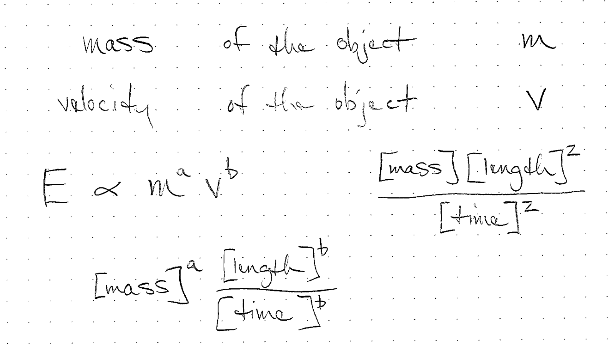

<h1 id="quantities">Quantities</h1>

When we use mathematics to model the physical world, we need additional tools to represent physical quantities. A number only gives a magnitude. When we combine that number with a unit (length, mass) it becomes a quantity that can represent something physical.

<h2 id="dimensions-units-quantities">Dimensions, units, quantities</h2>
<ul>
<li>A quantity represents a physical measurement like mass, length or amount of energy</li>
<li>We represent a quantity with a number and a unit</li>
<li>The dimension of a quantity is different than the unit</li>
<li>For example 1 inch is the same as 2.54 centimeters even though 1 and 2.54 are not the same number</li>
</ul>
<h2 id="physical-quantities">Physical Quantities</h2>
<ul>
<li>Our numbers are often helping us represent physical quantities</li>
<li>Examples:
<ul>
<li>The length of a tree</li>
<li>The number of animals observed</li>
<li>The number of molecules of mercury in a fish</li>
</ul></li>
<li>A physical quantity is expressed as the product of a unit and a numerical factor</li>
</ul>
<h2 id="dimensions">Dimensions</h2>
<ul>
<li>These physical quantities often have a dimension</li>
<li>Examples:
<ul>
<li>Length</li>
<li>Time</li>
<li>Mass</li>
</ul></li>
</ul>

In our estimations, we may have quantities that are not in fundamental units such as length or time. For example, we may be counting a population of animals, or the number of power plants needed.

<!-- physics have 7 primary dimensions, we may have others -->
<h2 id="units">Units</h2>
<ul>
<li>To quantify dimensions, we use units</li>
<li>One dimension may have multiple units</li>
<li>Length: inches, miles, kilometers, light-years</li>
<li>Mass: grams, pounds, kilograms</li>
<li>There are also systems of units like SI or English</li>
</ul>
<!-- what are some units and some unusual units -->
<!-- clicks, bytes, click velocity -->
<h2 id="measurement">Measurement</h2>
<ul>
<li>Each measurement we make is an estimation of the physical quantity</li>
</ul>
<h2 id="consequences">Consequences</h2>
<ul>
<li>NASA Mars Climate Orbiter destroyed because of newton vs pounds of force</li>
<li>A cargo flight was lost in 1999 when crew confused meters and feet</li>
</ul>
<h2 id="unit-conversion-factors">Unit conversion factors</h2>
<ul>
<li>These factors are equivalent to one or unity and are dimensionless</li>
<li>They are not numerically equal to one in most cases.</li>
<li>Units can be crossed out</li>
</ul>

<h2 id="unit-conversion-factors-1">Unit conversion factors</h2>
<ul>
<li>These factors are equivalent to one or unity and are dimensionless</li>
<li>They are not numerically equal to one in most cases.</li>
<li>Units can be crossed out</li>
<li>They can have units but be dimensionless</li>
</ul>
<h2 id="different-dimensions">Different Dimensions</h2>
<ul>
<li>You cannot convert a quantity with one dimension to another dimension with a unit conversion factor</li>
<li>There may be a linear relationship between those two quantities that looks like a “conversion” but isn’t</li>
</ul>
<h2 id="unit-conversion-factors-2">Unit conversion factors</h2>

These two quantities are equal.

 3 \textrm{feet} = 1 \textrm{yard} 

If we divide both sides by 3 feet, we get

 1 = \frac{1\ \textrm{yard}}{3\ \textrm{feet}}  

Note that this quantity has units of yard per feet, but has no dimensions since it is a length divided by a length. If you multiply a quantity of feet by this, you won’t change the quantity but you will change the units.

<h2 id="two-units-in-the-denominator">Two units in the denominator</h2>
<ul>
<li>Births per capita per year</li>
<li>Hours per week per unit</li>
</ul>
<h2 id="combinations-of-units">Combinations of units</h2>
<ul>
<li>We often combine units to express new quantities</li>
</ul>
<!-- can you think of a derived unit? -->
<h2 id="student-density">Student density</h2>
<ul>
<li>Students per acre</li>
<li>Number per area</li>
<li>Spans two orders of magnitude</li>
</ul>
<h2 id="example-units-of-students-per-acre">Example: Units of students per acre</h2>
<ul>
<li><a href="https://twitter.com/calpolypomona/status/431937140457349120/photo/1">Cal State densities</a> </li>
</ul>
<h2 id="dimensional-analysis-example">Dimensional analysis example</h2>

We can use the dimensions of the relevant quantities to deduce the form of an equation

<!-- what are some units and some unusual units -->
<!-- clicks, bytes, click velocity -->
<h1 id="mass-example">Mass Example</h1>

Convert the quantity of 150 pounds to kilograms.

 150\ {\color{blue}\cancel{\textrm{pounds}}}
   \cdot
   \frac{1\ \textrm{kilogram}}
        {2.2 \color{blue}\cancel{\textrm{pound}}}
   = 68\ \textrm{kilograms} 

<h1 id="speed-example">Speed Example</h1>

Convert the quantity of 100 miles per hour to meters per second. Note that we make two unit conversions. One from miles to meters and another from hours to seconds.

Once we have this set up, we perform the computation on a calculator or other device.

Some students prefer to perform this computation in steps.

 \frac{100\ {\color{blue}\cancel{\textrm{miles}}}}
        {\color{green}\cancel{\textrm{hour}}}
   \cdot
   \frac{1600\ \textrm{meters}}
        {\color{blue}\cancel{\textrm{mile}}}
   \cdot
   \frac{\color{green}\cancel{\textrm{hour}}}
        {3600\ \textrm{sec}}
   = \frac{44\ \textrm{meters}}
          {\textrm{sec}} 

<h1 id="per-per-example">“Per Per” Example</h1>

In August 2021, Sonoma County is recording 20 new cases per day per 100,000 people. If we have a population of 5,000 people, how many cases per week do we expect?

 \frac{20 \textrm{cases}}{{\color{green}\cancel{\textrm{day}}}\cdot 100,000\ \color{blue}\cancel{\textrm{people}}}
\cdot
   5,000\ {\color{blue}\cancel{\textrm{people}}}
\cdot
   \frac{7\ \color{green}\cancel{\textrm{day}}}{\textrm{week}}
= 7\ \textrm{cases per week}

