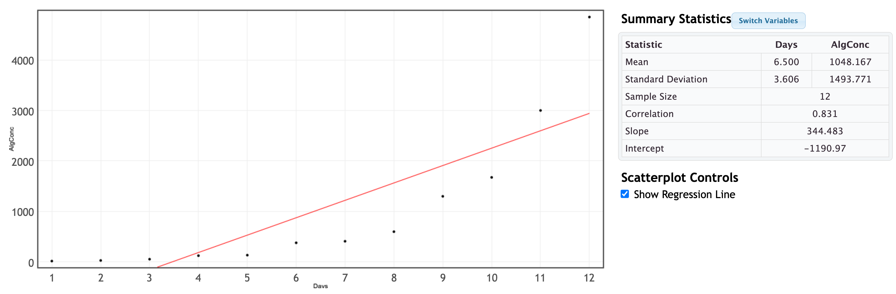
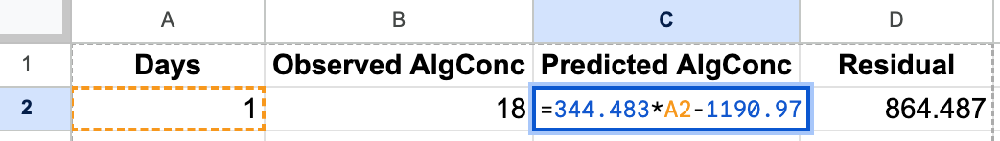
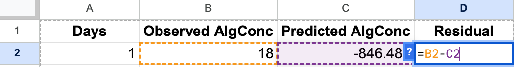
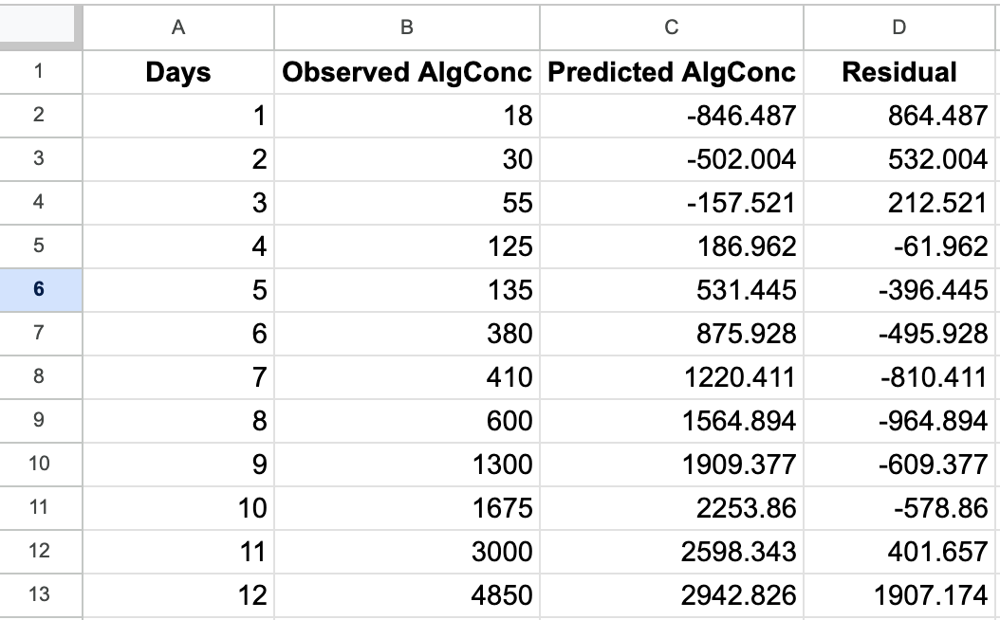
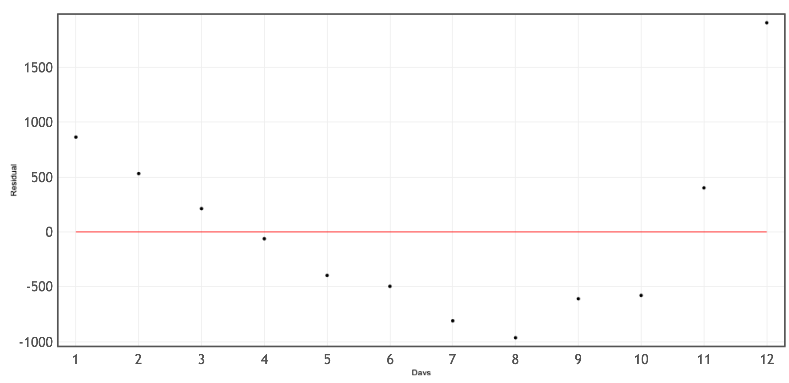
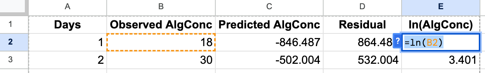
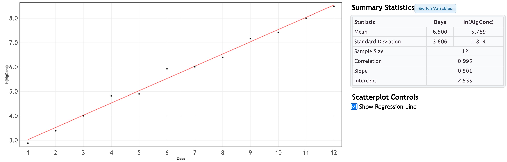
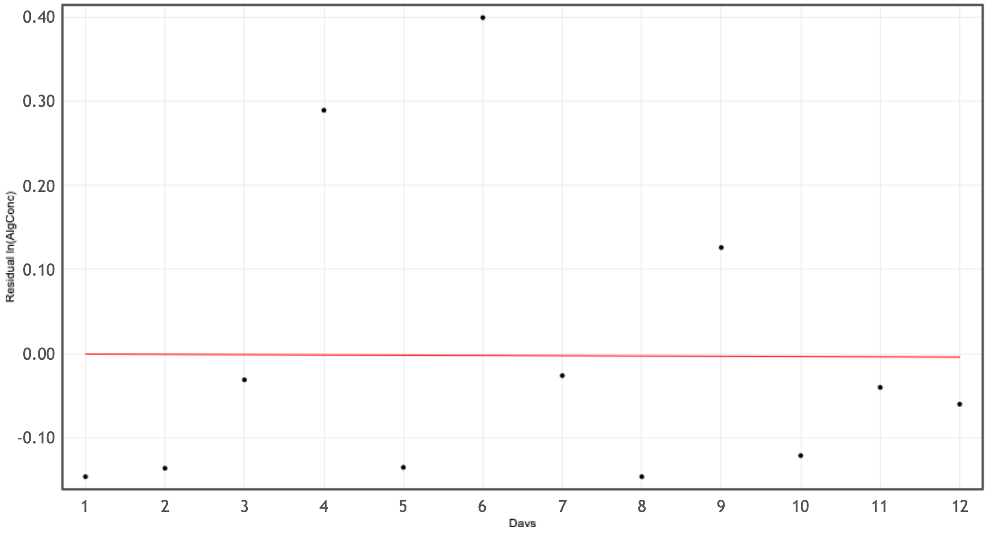

# Transforming Quantiative Relationships

In the last section, we emphasized the importance of meeting the conditions for using a linear model before interpreting the results. Up until now, we have only presented this as a problem without a solution. If our data does not satisfy one or more of the conditions, it is often a solution to transform, or reexpress one, or both, of your variables so that the conditions are reasonably satisfied

# Example: Using a Semi-Log Transformation on Algae Concentration over Time

We have data on **algae concentration** in a lake over time during early bloom growth. 

---

## 1. Create a Scatter Plot of Original Data

| Days | Algae Concentration  (cells/mL)|
|-----|-----|
| 1 | 18 |
| 2 | 30 |
| 3 | 55 |
| 4 | 125 |
| 5 | 135 |
| 6 | 380 |
| 7 | 410 |
| 8 | 600 |
| 9 | 1300 |
| 10 | 1675 |
| 11 | 3000 |
| 12 | 4850 |

The pattern is clearly nonlinear (curved upward). We can also create a residual plot to more clearly see the issue with our linear model.

## 2 Creating the Residual Plot 

To create the residual plot, we note the slope and intercept of the regression in our image above and have the least-squares equation:

$$
\widehat{AlgConc} = -1190.97 + 344.483x
$$

To create the residual plot, we recall that the residual be the observed algae concentration minus the predicted algae concentration.

$$AlgConc-\widehat{AlgConc}$$

Using Google Sheets, we can create a column for the predicted algae concentration using the formula $=344.483*A2-1190.97$ in cell C2, and a column for residuals unsing the formula $=B2-C2$ in cell $D2$. 

If we apply those formulas to all 12 rows we get

---

We can upload this data to StatKey and select $x=$ Days and $y=$ Residual and we see the pattern expressed in the residuals.

Residuals show a clear curved pattern → linear model is inappropriate.

---

## 3. Transforming the Data

Our goal is to transform the data so that the our relationship between Days and Algae Concentration can be expressed as a linear relationship.  Choosing the appropraite transformation can be tricky, and often involves some trial and error.  The first step is identifying the patterns you wish to eliminate.  Here we notice what might be exponential growth.  We see this from the upward curvature of the original plot, but also we know that population growth often follows an exponential pattern.  We learned previously that the logarithm will "undo" exponential growth, effectively linearizing the model. We will try a semi-log plot where we apply the logarithm to the algal concentration. Using the natural log, we will create a column in our Google Sheet called $ln(AlgConc$ and use the formula $=ln(B2)$ in cell E2.

Then apply this formula to all 12 days we download the Google Sheet.

---

## 4. Plot the Semi-Log Data

We upload our Google Sheet to StatKey, and see the following plot.

The transformed data appear approximately linear.

---

## 5. Semi-Log Model and Residuals

Fitted model:

$$
\widehat{\ln(AlgConc)} = 0.501(Days)+2.535  
$$

Residuals for our model can be added to our Google Sheet:

$$
\ln(AlgConc) - \widehat{\ln(AlgConc)}
$$

---

We note that a residuals are now showing no systematic pattern. Our semi-log transformation was successfull!

---

## Summary

- Original model: poor fiting line, scatterplot showed curvature, and residual plot showed a pattern
- Semi-log model: linear scatterplot, randomly scattered residuals  
