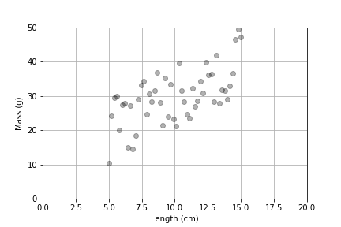

<h1 id="linear-regression">Linear Regression</h1>

 Linear regression uses data from two quantitaive variables, typically and explantory variable and a response variable to produce a linear equation that describes the linear relationship between the variables, and also provides some measures that describe the uncertainty that is inherent in the data. 

<h2>The Signal and the Noise</h2>

In linear regression Noise is often used in contrast to the signal, which is considered the variation that is being explained by the expanatory variable.

Below is a scatter plot that shows the relation ship between mass and length. We see that there is certainly a linear releationship suggested in the plot, but there is also quite a bit of statistical noise. The term "noise" refers  to random variation or unexplained fluctuations in data that are not being explained by the explanatory variable. 

<figure>
<figcaption aria-hidden="true">Linear data with noise</figcaption>
</figure>
<h1 id="questions">Questions</h1>

By finding the underlying slope in the data, we can ask what is the average change in a measurement based on a change in the other measurement.

By measuring the variation in the data around that line, we can ask how much of the measurement is explained by the linear relationship and how much of the measurement can’t be explained yet.

<h1 id="definitions">Definitions</h1>
<h2 id="scatter-plot">Scatter Plot</h2>

A plot to visualize data in terms of an independent and dependent variable.

<h2 id="independent-variable">Independent Variable</h2>

This is the variable that we can “control” in an experiment or study.

<h2 id="dependent-variable">Dependent Variable</h2>

This is the variable that measures the outcome in our experiment or study.

<h2 id="linear-regression-1">Linear Regression</h2>

The mathematical technique used to determine the linear model that “best” fits a set of data. In linear regression, we have one independent variable and one dependent variable.

This fit is quantified by minimizing the areas of the squares that fit between the data and the line as represented in the following link.

<a href="https://www.geogebra.org/m/JsFmFEg6">Least Squares Visualization</a>

<h2 id="anscombes-quartet">Anscombe’s Quartet</h2>

Note that data can have the same regression results but be very different in shape. We must be sure that our data match our assumptions.

<a href="https://en.wikipedia.org/wiki/Linear_regression#/media/File:Anscombe&#39;s_quartet_3.svg">Wikipedia SVG</a>

<a href="https://www.autodesk.com/research/publications/same-stats-different-graphs">Datasaurus Dozen</a>

<h2 id="multiple-linear-regression">Multiple Linear Regression</h2>

This is a regression model that has multiple independent variables and one dependent variable.

These models help us determine the relative contribution of these multiple independent variables.

