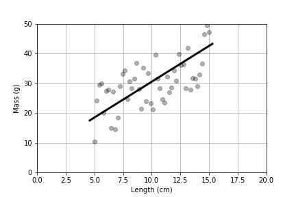
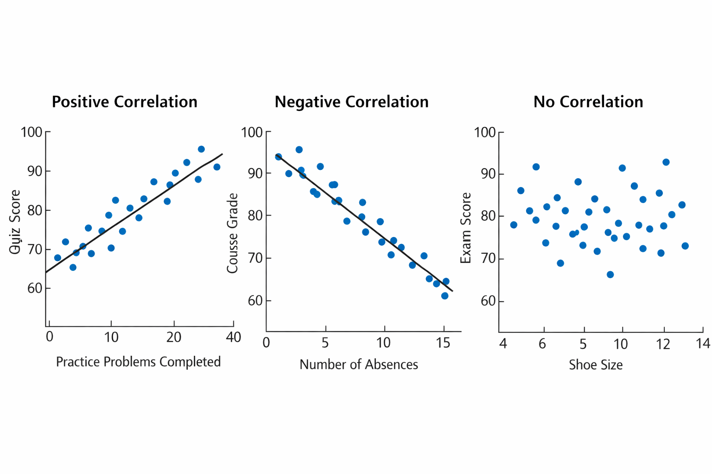

<h1 id="linear-regression">Linear Regression</h1>

 Linear regression uses data from two quantitaive variables to produce a linear equation that best describes the linear relationship between the variables. Additionally, the regression procedure provides information that describes the uncertainty that is inherent in the data. 

<h2>The Signal and the Noise</h2>

In linear regression, we seek to describe the variation in the values of the reponse variable, $y$. This variation will be attributed to two things: 

  <ul>
<li>(1) The values of the explanatory variable. This is often refered to as the <b>signal</b>. The signal is the model (equation) that gives the response variable $y$ in terms of the explanatory value $x$. Our linear regression equation will take the form $\hat{y}=a+bx$ where $\hat{y}$ is a predicted response value. Notice that the value for $\hat{y}$ is being explained by the value of $x$ here, which is another way of saying that $\hat{y}$ is a function of $x$. </li> 
<li>(2) Random fluctuations in the data, sometimes called <b>sampling error</b>. This is what is sometimes  referred to as <b>noise</b>. This can be thought of as the variation that is not being explained by the model. </li> 
  </ul>
  
When doing regression, we are trying to separate the signal from the noise.

Below is a scatter plot that shows the relationship between mass and length. While there a clear a linear releationship suggested in the plot, there is also quite a bit of statistical noise.  

<figure>
<figcaption aria-hidden="true">
</figure>

The line shown in the figure above is explaining the mass to some degree as it is clear that the mass is increasing linearly as length increases, but the data varies quite a bit above and below the line. That variation around the line is the unexplained "noise" around the "signal" (the line).

# The Regression Line

As mentioned before, the regression line will take the form $\hat{y}=a+bx$, where $a$ is the intercept and $b$ is the slope of the regression line. We will often be asked to interpret the slope and/or the intercept in the context of real data.  Recall that for a linear equation $y=mx+b$, the slope $m$ is the change in the $y$-value for every unit change in the $x$-value. Here, we only need to make the small adjustment that we do not *know* the $y$ value, we are *predicting* the $y$-value. This is why we use the $\hat{y}$ notation.

## Example

Suppose we have a sample from 100 adults over 40 for whom we have collected two quantitative variables: Income (per year in $1000s), and years of education beyond a high school degree.  We wish to explore the association between $Income$ and $Years$. We find a linear regression equation $$\widehat{Income}=41.5+15.6(Years)$$ 

The slope of 15.6 tells us that the model predicts an increase of $15,600 per year in annual income for each additional year of education beyond a high school degree for adults over 40.  The intercept of 41.5 predicts a $41,500 per year income for a person over 40 with no education beyond a high school degree.
<h1>Understanding $r$, the Correlation Coefficient</h1>
      

        The correlation coefficient is a number that describes the strength and direction (positive or negative) of a linear relationship between two quantitative variables.
      

      <h2 id="range-values">The range of <em>r</em></h2>
      

        The value of <strong>$r$</strong> is always between <strong>-1</strong> and <strong>1</strong>.
      

      <ul class="value-list">
        <li><strong>$r = 1$</strong>: a perfect positive linear relationship</li>
        <li><strong>$r = -1$</strong>: a perfect negative linear relationship</li>
        <li><strong>$r = 0$</strong>: no linear relationship</li>
      </ul>
      

        Most real data fall somewhere in between. Values closer to <strong>1</strong> or <strong>-1</strong>
        show a stronger linear relationship, while values closer to <strong>0</strong> show a weaker one.
      

    
CORRELATION WARNINGS: 
    <ul>
    <li>(1) The correlation is only useful in the context of analyzing a <b>linear relationship</b>. We need to check the scatter plot for to confirm that the data appears somewhat linear before incorporating $r$ into out analysis.</li>
    <li>(2) $r$ can be heaviliy influenced by outliers.  We need to check the plot to understand to what degree any outliers may be influencing $r$.</li>
    </ul>
  
 Unlike the formal procedure we learned for identifying outliers for a single quantitative variable, we will not learn a formal procedure for finding outliers in a scatter plot. To identify outliers, we look for data values that do not follow the general trend tha the other data follow. Likewise, we will not have a formal test for linearity. Will use the 'eyeball' test, which means we will make an informal observation based on the general appearance of the plot.

  

    <section class="card" aria-labelledby="interpretation">
      <h2 id="interpretation">How to interpret the sign and strength</h2>
      
Once we have confirmed our plot is reasonably linear and no significant outliers exist, we can interpret $r$ as follows.

      

        

          <h3>Sign</h3>
          

            The <strong>sign</strong> tells the direction of the relationship.
          

          <ul>
            <li><strong>Positive r</strong>: as one variable increases, the other tends to increase.</li>
            <li><strong>Negative r</strong>: as one variable increases, the other tends to decrease.</li>
          </ul>
        

        

          <h3>Strength</h3>
          

            The <strong>size</strong> of the number tells how tightly the points follow a straight-line pattern.
            A value like <strong>0.82</strong> suggests a stronger linear relationship than <strong>0.23</strong>.
          

        

      

    </section>
    <section class="card" aria-labelledby="examples">
      <h2 id="examples">Simple examples</h2>
      <article class="example-box">
        <h3>Example 1: Positive correlation</h3>
        

          Suppose we compare the number of practice problems completed and quiz scores. Students who complete more
          practice problems often earn higher quiz scores. This would likely produce a <strong>positive</strong>
          correlation.
        

      </article>
      <article class="example-box">
        <h3>Example 2: Negative correlation</h3>
        

          Suppose we compare the number of absences and course grades. Students with more absences may tend to earn
          lower grades. This would likely produce a <strong>negative</strong> correlation.
        

      </article>
      <article class="example-box">
        <h3>Example 3: Little or no correlation</h3>
        

          Suppose we compare shoe size and exam score in a class. There is no reason to expect a consistent
          straight-line relationship, so the correlation would probably be close to <strong>0</strong>.
        

      </article>
    </section>
    <figcaption aria-hidden="true">
    <section class="card highlight" aria-labelledby="correlation-not-causation">
      <h2 id="correlation-not-causation">Correlation is not causation</h2>
      

        This is one of the most important warnings in statistics. Even if two variables have a strong correlation,
        that does not mean one variable causes the other to change.
      

      

        For example, ice cream sales and sunscreen sales may both rise during the summer. They are related,
        but buying ice cream does not cause people to buy sunscreen. Instead, both are influenced by a third factor:
        warm weather.
      

    </section>
    <section class="card" aria-labelledby="using-scatterplots">
      <h2 id="using-scatterplots">Why scatterplots matter</h2>
      

        A correlation coefficient is useful, but it should not be used alone. A scatterplot helps you actually
        see the pattern in the data. Two data sets can have similar correlation values but look very different when
        graphed.
      

      

        In practice, it is best to look at the scatterplot first and then use the correlation coefficient as a summary.
      

    </section>
 <section class="card" aria-labelledby="important-notes">
      <h2 id="important-notes">Important ideas to remember</h2>
      <ul class="key-points">
        <li>Correlation describes the relationship between <strong>two quantitative variables</strong>.</li>
        <li>Correlation measures how well the data follow a <strong>linear relationship</strong>.</li>
         <li>Outliers can have a strong effect on the correlation</li>
        <li>A strong correlation does <strong>not</strong> prove that one variable causes the other.</li>
      </ul>
    </section>
