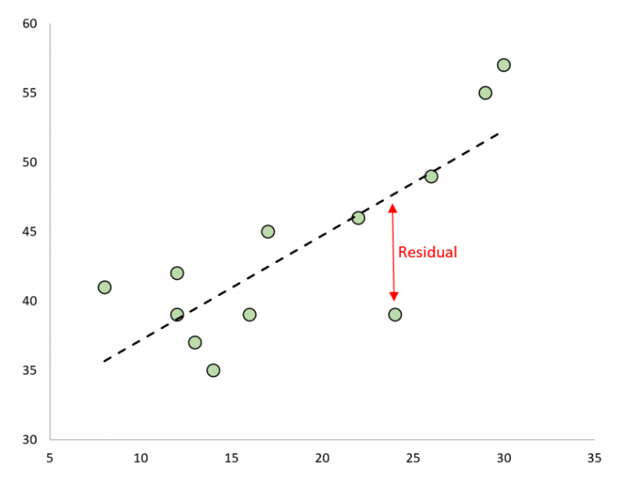
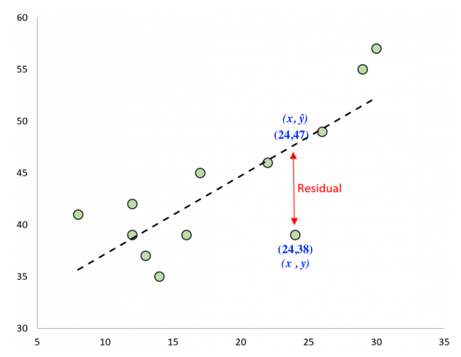

<h1 id="linear-regression">Linear Regression</h1>

 Linear regression uses data from two quantitaive variables to produce a linear equation that best describes the linear relationship between the variables. Additionally, the regression procedure provides information that describes the uncertainty that is inherent in the data. 

<h2>The Signal and the Noise</h2>

In linear regression, we seek to describe the variation in the values of the reponse variable, $y$. This variation will be attributed to two things: 

  <ul>
<li>(1) The values of the explanatory variable. This is often refered to as the <b>signal</b>. The signal is the model (equation) that gives the response variable $y$ in terms of the explanatory value $x$. Our linear regression equation will take the form $\hat{y}=a+bx$ where $\hat{y}$ is a predicted response value. Notice that the value for $\hat{y}$ is being explained by the value of $x$ here, which is another way of saying that $\hat{y}$ is a function of $x$. </li> 
<li>(2) Random fluctuations in the data, sometimes called <b>sampling error</b>. This is what is sometimes  referred to as <b>noise</b>. This can be thought of as the variation that is not being explained by the model. </li> 
  </ul>
  
When doing regression, we are trying to separate the signal from the noise.

Below is a scatter plot that shows the relationship between mass and length. While there a clear a linear releationship suggested in the plot, there is also quite a bit of statistical noise.  

<figure>
<figcaption aria-hidden="true">
</figure>

The line shown in the figure above is explaining the mass to some degree as it is clear that the mass is increasing linearly as length increases, but the data varies quite a bit above and below the line. That variation around the line is the unexplained "noise" around the "signal" (the line).

Definition: A **residual** is the difference between the observed value of the response variable and the value predicted by the regression line.

$$
\text{Residual} = y - \hat{y}
$$

where

- $y$ is the actual observed value  
- $\hat{y}$ (y-hat) is the predicted value from the model

The image below shows the residual in red. 

A residual tells us how far off the model was for one particular data point. 

We can estimate the value of the residual that is highlighted in the image above for the data value associated with the point at $x=24$. We estimatethat $y=38$ and $\hat{y}=47$, hence our estimate for the value of the residual is $38-47=-9$. This tells us that the $y$-value is 9 less than the regression line predicts when $x=24$.

It follows from the calculation that a positive residual implies the observed value is **above** the predicted value. And negative residual implies the observed value is **below** the predicted value.
