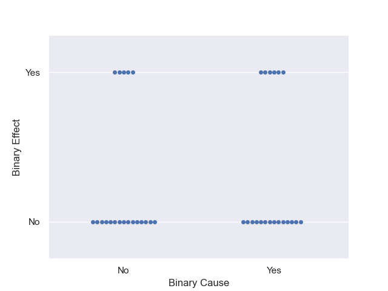

<h1 id="relationships">Relationships</h1>

We are often interested in determining if cause and effect are
present in natural, environmental, and social phenomena. This is
important because we may be able to use these causal relationships to
improve our environment and its sustainability.

This usually means determining if there is a mathematical
relationship between quantitative measurements of our world.

<ul>
<li>Does increasing fertilizer increase the amount of harvest of a crop?
Is there a limit to this increase?</li>
<li>Does presenting citizens with facts about global warming lead to
changed behaviors?</li>
<li>Does early childhood education improve educational and economic
outcomes much later in life?</li>
</ul>

If these relationships are present and significant, we can make
decisions that improve human and environmental health.

The relationship is a feature of our world that exists between to
measurable quantities.

The graphs we create are depictions of this relationship.

<h1 id="what-do-you-see">What do you see?</h1>

Below are several plots. What do you see in the plots?

<ul>
<li>What type of data is being shown?</li>
<li>Is there a relationship in the data? (Does it look like the value on
the x-axis affects the value(s) on the y-axis?)</li>
</ul>
<!--  -->

Graph 1

<figure>

<figcaption aria-hidden="true">1</figcaption>
</figure>

Graph 2

<figure>

<figcaption aria-hidden="true">2</figcaption>
</figure>

Graph 3

<figure>

<figcaption aria-hidden="true">3</figcaption>
</figure>

Graph 4

<figure>

<figcaption aria-hidden="true">4</figcaption>
</figure>

Graph 5

<figure>

<figcaption aria-hidden="true">5</figcaption>
</figure>

Graph 6

<figure>

<figcaption aria-hidden="true">6</figcaption>
</figure>

Graph 7

<figure>

<figcaption aria-hidden="true">7</figcaption>
</figure>

Graph 8

<figure>

<figcaption aria-hidden="true">8</figcaption>
</figure>
<h1 id="types-of-data">Types of Data</h1>
<ul>
<li>Continuous Quantitative</li>
<li>Discrete Quantitiative</li>
<li>Binary Quantitative</li>
<li>Categorical</li>
</ul>
<h1 id="dependent-and-independent-variables">Dependent and Independent
Variables</h1>
<ul>
<li>can think of as cause and effect</li>
<li>independent variable
<ul>
<li>convention is this variable is a potential cause</li>
<li>we place it on the x-axis</li>
</ul></li>
<li>dependent variable
<ul>
<li>convention is this variable is affected by the independent
variable</li>
<li>we place it on the y-axis</li>
</ul></li>
</ul>
<h1 id="strength-of-relationships-and-associations">Strength of
Relationships and Associations</h1>

There are several quantities we can compute that tell us about the
strength of the relationship.

One you may have heard of is the correlation coefficient.

<h1 id="time-series-data">Time Series Data</h1>

We often plot time on the x-axis and a number, say temperature, on
the y-axis. This is called a time series plot.

These time series plots are not always good examples of a
relationship.

<h1 id="proxy-data">Proxy Data</h1>

Sometimes we do not have direct data on something we want to
observe.

In those cases, we may use proxy data. Proxy data are other directly
measureable things that have some relationship with the item we want to
observe.

For example, tree ring widths are used as a proxy for rainfall and
temperature.

<!-- # Proportional Reasoning

- speed, time, and distance
- doubling a cookie recipe
- what things are not proportional? -->
<h1 id="intuition-and-quantitative-relationships">Intuition and
Quantitative Relationships</h1>

We often have strong convictions that certain relationships do exist
or should exist. However, some of these convictions are not based in
evidence (they are pure vibes).

While our intuition can be correct, it is important to check that our
convictions rest on a strong empirical base.

<h1 id="examples">Examples</h1>
<ul>
<li><a
href="https://www.nih.gov/news-events/nih-research-matters/study-suggests-epstein-barr-virus-may-cause-multiple-sclerosis">Epstein-Barr
and MS</a></li>
<li><a href="https://www.science.org/doi/10.1126/science.adg0344">White
Nose Fungus in Bats</a></li>
<li><a
href="https://coralreefs.blogs.rice.edu/2017/03/23/toxic-air-how-ocean-acidification-affects-reef-organisms/">Coral
Reefs</a></li>
<li><a href="https://www.pnas.org/doi/10.1073/pnas.2209123120">Student
sleep study</a></li>
<li><a
href="https://www.brookings.edu/articles/accounting-for-the-widening-mortality-gap-between-american-adults-with-and-without-a-ba/">College
education and life expectancy</a></li>
</ul>
