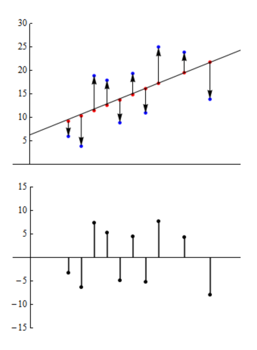
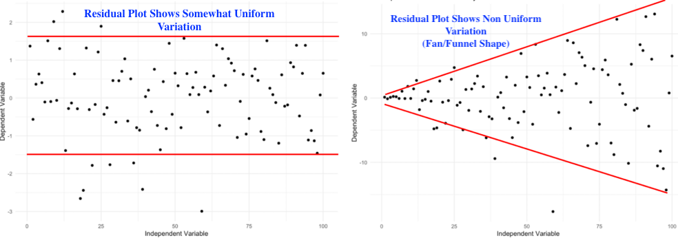

# Residual Analysis in Linear Regression

In the last section we noted that a linear model consisted of a linear equation (the signal) and the random variation associated with the data (the noise). Our signal is expressed as the linear equation $\hat{y}=a+bx$, but how can we quantify the noise associated with unexplained variability? We do this by drawing our attention to the discrepancy between our regression equation and the obseved data. In other words, we want to measure how well (or poorly) is the equation doing at capturing the observed data by noting the difference between the predicted values of our response variable $\hat{y}$ and the observed values $y$ in our data. This difference is what we call this the residual.  

Definition: A **residual** is the difference between the observed value of the response variable and the value predicted by the regression line.

$$
\text{Residual} = y - \hat{y}
$$

where

- $y$ is the actual observed value  
- $\hat{y}$ (y-hat) is the predicted value from the model

The image below shows the residual in red. 

A residual tells us how far off the model was for one particular data point. 

We can estimate the value of the residual that is highlighted in the image above for the data value associated with the point at $x=24$. We estimatethat $y=38$ and $\hat{y}=47$, hence our estimate for the value of the residual is $38-47=-9$. This tells us that the $y$-value is 9 less than the regression line predicts when $x=24$.

It follows from the calculation that a positive residual implies the observed value is **above** the predicted value. And negative residual implies the observed value is **below** the predicted value.

## Why residuals matter

When we fit a regression line, we are trying to describe the relationship between an explanatory variable and a response variable. But finding a regression equation is not the end of the story.

We also need to ask:

- Does a linear model make sense here?
- Does the model miss an important pattern?
- Are the prediction errors reasonably small and well behaved?

Residual analysis helps answer those questions.

In simple terms, residuals help us decide whether the regression model is doing a good job.

## What we want residuals to look like

For a linear regression model to be appropriate, the residuals should look **random**.

That means:

- they should be scattered around $0$
- they should not form a curve or other pattern
- they should have about the same spread across the graph

If the residuals look random, that supports the idea that a linear model is reasonable.

If the residuals show a pattern, that is a warning sign that the model may not fit well.

## The residual plot

One of the most common tools in regression is the **residual plot**.

A residual plot graphs:

- the residuals on the vertical axis
- either the predictor values or the fitted values on the horizontal axis

The horizontal line at $0$ is especially important because it shows where the model predicts exactly correctly.

Below we see the residual plot directly below the scatter plot and line-of-best-fit. The upward pointing arrows represent the positive residuals.

### A good residual plot

A good residual plot looks like a random cloud of points centered around $0$.

This suggests:

- the relationship is roughly linear
- the model is not systematically overpredicting or underpredicting
- the variation in residuals is fairly constant

### A bad residual plot

A bad residual plot may show a visible pattern.

For example:

- a curved shape may suggest the relationship is not linear
- a funnel shape may suggest the spread changes as $x$ increases
- a cluster or trend may suggest the model is missing something important

## Common patterns and what they mean

### Curved pattern

If the residuals bend upward and downward in a clear curve, the relationship may not be linear.

### Funnel (or Fan) shape

If the residuals spread out or compress as $x$ increases, the variability is not constant.

### Outliers

If we find that some data produces residuals are much larger than the others, those points may need to be treated as unusual, aka outliers. 
Outliers can have disproportionate effect on out linear model.

## Interpreting residual size

The size of a residual tells us how inaccurate a prediction was.

- Small residuals $\rightarrow$ prediction was close  
- Large residuals $\rightarrow$ prediction was far off  

## Main idea to remember

> If a linear model is appropriate, the residuals should look random and patternless.

## Summary

- Residual $= y - \hat{y}$  
- Residuals measure prediction error  
- Residual plots help check model validity  
- Good residuals look random  
- Patterns indicate problems  
