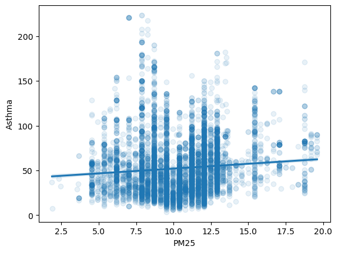
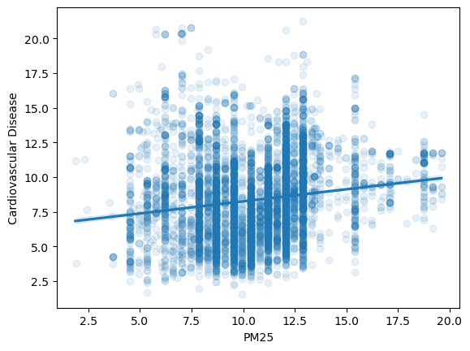

<h1 id="calenviroscreen">CalEnviroScreen</h1>

The CalEnviroScreen tool and data set provides examples of several of the concepts we are exploring in this course.

Here are some example questions and a tool that can provide evidence.

<ul>
<li>How asthmatic is california?
<ul>
<li>histogram/distribution</li>
<li>mean/median/deviation</li>
</ul></li>
<li>How is my regions asthma compared to CA?
<ul>
<li>percentile</li>
</ul></li>
<li>If I choose an area at random in CA, what is the chance it has higher asthma than my area?
<ul>
<li>percentile</li>
</ul></li>
<li>Do any groups (age, ancestry) have worse asthma
<ul>
<li>compare population histograms/means</li>
</ul></li>
<li>Are there variables that correlate with asthma?
<ul>
<li>linear regression</li>
</ul></li>
</ul>
<h1 id="associations">Associations</h1>

Keep in mind that these associations do not on their own establish causality.

      

