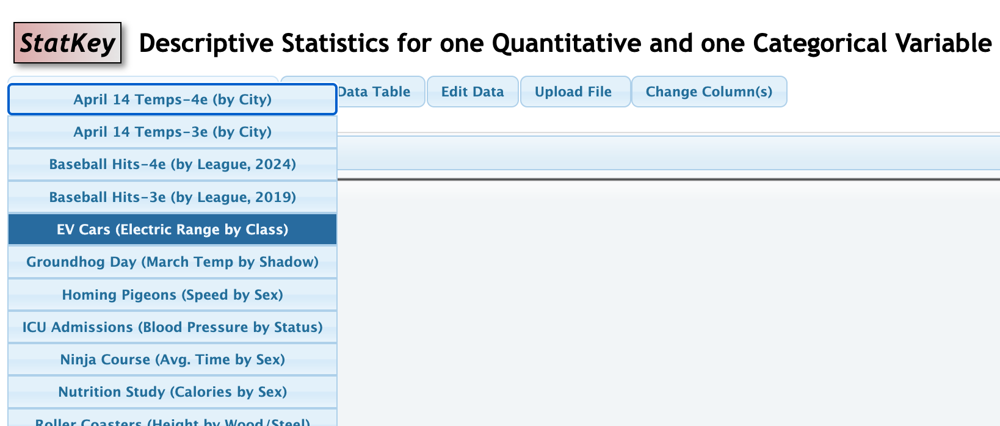

# Descriptive Statistics Exercises
# For Questions #1-3: 

(a) identify the cases

(b) identify the variable(s) 

(c) for each variable you identified determine whether the variable is categorical or quantitiative.

## 1) Hormones and Fish Fertility 

When birth control pills are taken, some of the hormones found in the pills eventually make their way into lakes and waterways. In one study, a water sample was taken from various lakes. 
The data indicate that as the concentration of estrogen in the lake water goes up, the fertility level of fish in the lake goes down. The estrogen level is 
measured in parts per trillion (ppt) and the fertility level is recorded as the percent of eggs fertilized. 
## 2) Do metal tags on penguins harm them? 
Scientists trying to tell penguins apart have several ways to tag the birds. One method involves wrapping metal strips with ID numbers around the penguin’s flipper,
while another involves electronic tags. Neither tag seems to physically harm the penguins. However, since tagged penguins are used to study all penguins, scientists wanted to determine whether the metal
tags have any significant effect on the penguins. Data were collected over a 10-year time span from a sample of 100 penguins that were randomly given either metal or electronic tags. In addition to type of tag worn, researchers also collected 
information on number of chicks, whether they survived the decade, and length of time spent on foraging trips.

##  3) Don’t Text While Studying! 
For the 2015 Intel Science Fair, two brothers in high school recruited 47 of their classmates to take part in a two-stage study.
Participants had to read two different passages and then answer questions on them, and each person’s score was recorded for each of the two tests. 
There were no distractions for one of the passages, but participants received text messages while they read the other passage. Participants scored significantly worse when distracted by incoming texts.
Participants were also asked if they thought they were good at multitasking (yes or no) but even students who were confident of their abilities did just as poorly on the test while texting.

# For Questions #4-6: 

(a) identify the cases

(b) identify the variables

(c) for each variable you identified determine which variable is explanatory and which is the response

(d) Is the study and observational study or an experiment? Justify your answer

## 4) Potassium Levels in Spinach 
A study examining spinach leaves from a variety of different locations finds that spinach grown in soil with high amounts of iron tends to have lower levels of potassium.

## 5) Does Eating Organic Food Make Fruit Flies Live Longer? 
For a high school science project, a 16-year-old girl randomly divided fruit flies into two groups, and fed one group organic food and the other group conventional (non-organic) food.
The flies fed organic food lived an average of 3.25 days longer than the flies fed conventional food. 

## 6) How to Debate a Science Denier

Science deniers oppose robust and valid results of scientific inquiry. A recent study investigates the most effective ways to debunk scientific misinformation. Science advocates can respond to misinformation using topic rebuttal (providing scientific facts on the subject) or technique rebuttal (explaining more generally the false techniques used by science deniers). In the study, 1773 participants first listened to a science denier and were then randomly assigned to one of four conditions: no rebuttal, topic rebuttal, technique rebuttal, or both topic and technique rebuttal. Participants’ attitudes toward the science topic were measured and recorded three times: before participation, after the science denier, and after the rebuttal. Results indicate the importance of having a rebuttal: participants on average were influenced by the science denier, but the influence was mitigated by having any rebuttal. The study further showed that topic or technique rebuttal worked equally well, and having both provided no additional benefit.

# Questions #7-9 will require that you use the *One Quantitative and One Categorical Variable* module on Statkey

# Questions #7-8 will require a dataset download and Statkey upload

Go to [Lock Datasets](https://www.lock5stat.com/datapage4e.html) and download the files referenced in the problem .csv format according to the instructions in the video *Uploading a File to Statkey* In addition to the in-class handout done on Monday 4/13, a video is posted on our Canvas Page in the *Statkey Links and Support Videos* module. You can also access it on [You Tube](https://www.youtube.com/watch?v=IA7TMmICjLk)

## 7)  GPA and Night Owls vs Morning Larks 
This exercise follows the video tutorial referenced above.  This data is stored in *SleepStudy* on the Lock Dataset page. Use Statkey to find the following statistics. Review the tutorial videos on Canvas, as needed. Use the appropriate notation for each.

(a) The mean *GPAs*.

(b) Create side-by-side boxplots to compare the *Owl* group and the *Lark* group. report the difference of means.

(c) Compare the values in the boxplots, i.e the 5-number summary, for $Owl$ and $Lark$ to make a decision about which group as a whole seems to have a better GPA.

## 8)  Finger Tapping and Caffeine 
The effects of caffeine on the body have been extensively studied. In one experiment, researchers examined whether caffeine increases the rate at which people are able to tap their fingers. Twenty students were randomly divided into two groups of 10 students each, with one group receiving caffeinated coffee and one group receiving decaffeinated coffee. The study was double-blind, and after a 2-hour period, each student was tested to measure finger tapping rate (taps per minute). The goal of the experiment was to determine whether caffeine produces an increase in the average tap rate. This data is stored in *Caffeine Taps* on the Lock Dataset page. Use Statkey to find the following statistics. Review the tutorial videos on Canvas, as needed. Use the appropriate notation for each.

(a) The mean number of *Taps* for all 20 students.

(b) Create side-by-side boxplots to compare *Taps* between the *Caffeine* group and the *NoCaffeine* group. Report the difference of means $\bar{x}_C-\bar{x}_N$ where $C$ is the caffeine group and $N$ is the no caffeine group.

(c) Does the value in 7b seem to provide evidence that caffeine is reponsible for the increase in tap rate. You should state the type of study that was done to defend your answer.

(d) Interpret the values you found for the standard deviation for each group. In other words, what are the values for standard deviation measuring with regards to the values in each category?

(e) Calculate the $z$-score for the maximum value in the *Caffeine* group. Then comment on whether this $z$-score suggests the maximum of the *Caffeine* group should be considered an unusual value.

(f) Calculate the $z$-score for the maximum value in the *NoCaffeine* group.  Then comment on whether this $z$-score suggests the maximum of the *NoCaffeine* group should be considered an unusual value.

## 9) EV Range by Class
A Plug-in Hybrid Electric Vehicle (PHEV) combines a gasoline engine with an electric motor and a larger battery that can be plugged in to charge. BEVs (Battery Electric Vehicles) run 100% on electricity. This data is available in the drop down menu under EV Cars (Electric Range by Class). See image below.

(a) Report the difference of means.

(b) What is the maximum range in the PHEV category?

(c) What is the minimum range in the BEV category?

(d) Report the standard deviation in each category.

(e) Interpret the values you found for the standard deviation for each group. In other words, what are the values for standard deviation measuring with regards to the values in each category?

(f) Which group seems to be exhibiting more variation in range? Use the standard deviation and the IQR to defend your answer.

---

# Questions #10-#12 will require you use the *Two Quantitative Variable* module on Statkey

## 10) Vegetable Consumption and Physical Activity in the US

Is there a linear relationship between the percentage of residents in a state who eat at least one serving of vegetables per day and the percentage of residents in a statewho do 150+ minutes of aerobic physical activity per week? The *USStates* dataset contains data collected on the 50 US States. You will need to download this data set from the Lock dataset site (like datasets for #7 and #8). Two variables in this dataset are *Vegetables* and *PhysicalActivity*. Use Statkey to find the following statistics. Review the tutorial videos on Canvas, as needed. Use the appropriate notation for each. Treat $PhysicalActivity$ as the explantory variable.

(a) Look at the scatter plot. Confirm that the data looks linear and that no significant outliers exist. (See the notes in the Linear Regression section under Correlation Warnings for how we determine linearity and outliers)  Report the the value of $r$ (the correlation coefficient).

(b) Comment on the strength and direction of the linear relationship based on your value for $r$

(c) State the regression equation in the form $\hat{y}=a+bx$. (Your equation should not use $y$ and $x$, but rather the names of the variables.)

(d) Interpret the slope of the regression equation. Be sure to include units in your interpretation.

## 11) pH and Mercury in Florida Lakes 

The **FloridaLakes** dataset can be found in the drop down menu on Statkey in the *Two Quantitative Variable* module. The dataset describes characteristics of water samples taken at 53 Florida lakes. Alkalinity (concentration of calcium carbonate in mg/L) and acidity (pH) are given for each lake. In addition, the average mercury level is recorded for a sample of fish (largemouth bass) from each lake. A standardized mercury level is obtained by adjusting the mercury averages to account for the age of the fish in each sample. Notice that the cases are the 53 lakes and that all variables are quantitative.

(a) Discuss the scatterplot. Does the relationship between pH and mercury concentration appear linear? 

(b) Report the the value of $r$ (the correlation coefficient). How strong is the relationship between pH and mercury concentration? (Extremely Strong, Strong, Moderately Strong, or Weak) Justify your choice.

(c) Interpret the meaning of the sign of your $r$ value in the context of the problem.

(d) State the regression equation in the form $\hat{y}=a+bx$. (Your equation should not use $y$ and $x$, but rather the names of the variables.)

(e) Interpret the slope of the regression equation. Be sure to include units in your interpretation.

(f) Can we conlude that the lower pH values are responsible for the high mercury concentrations? Explain.

## 12) Speed vs Drop on Rollercoasters
We wish to see if there is linear relationship between the speed (miles/hour) of a roller coaster and the height of the drop (in feet). The data can be found in drop-down menu in the *Two Quantitative Variable* module under Roller Coasters(Speed vs Drop).

(a) Discuss the scatterplot. Does the relationship between *Speed* and *Drop* appear linear? How strong is the relationship between *Speed* and *Drop*?

(b) Report the the value of $r$ (the correlation coefficient). Interpret the value for $r$ in the context of the problem.

(c) State the regression equation in the form $\hat{y}=a+bx$. (Your equation should not use $y$ and $x$, but rather the names of the variables.)

---

# Instructions for Exercises 13-15

The data for each exercise are provided as .csv files in the Canvas assignment. Download the files onto your computer for upload to StatKey.  You will also need to import them into a spreadsheet, like Google Sheets.

For each dataset, complete the following tasks:

(a) Create a scatterplot of the explanatory variable (x) and response variable (y).

(b) Report the regression equation $\hat{y}=a+bx$.

(c) Describe the direction, form, and strength of the relationship: 

- Direction: positive, negative, or none
- Form: linear or non linear (curved)
- Strength: weak, moderate, or strong
  
(d) Create a third column in your datset entiled *Predicted*. This column will use the regression equation to compute a predicted response $\hat{y}$ for each value of your explanatory variable using the regression equation you found in (b).

(e) Create a fourth column in your dataset entitled *Residuals* that will calculate the residuals for each value of the explanatory variable.

(f) Provide a residual plot where the vertical axis shows the residual and the horizontal axis is the explanatory variable. Are there any issues that you see that would cause concern about using a linear model? See course notes about problematic residual plots.

(g) You should have found that two of the three relationships exhibited problematic residual plots. **For the relationship that did NOT exhibit a problematic residual plot**,(1) report the value of the correlation coefficient, $r$, and (2) interpret the value of the slope $b$ in the regression equation from part (b). We will return to those plots that showed residual plot issues in problems #16-17.

## 13) Is study time associated with test scores? (Study Time(x) and Test Score(y)) 

## 14) Does spending on advertising increase sales? (Advertising(x) and Sales (y))

## 15) How does the voltage across a discharging capacitor change over time? (Time (x) and Voltage (y))
---
# For Exercises 16 and 17, you will improve the two non linear relationships from #13-15 using a transformation.

<!--(c) using the specified transformation
Exercise 2: take the log of the response variable
Exercise 3: create a squared term for the explanatory variable
Create a new scatterplot using the transformed variable(s).
Fit a new regression model using the transformed data.
Create a new residual plot for the transformed model.16 -->

